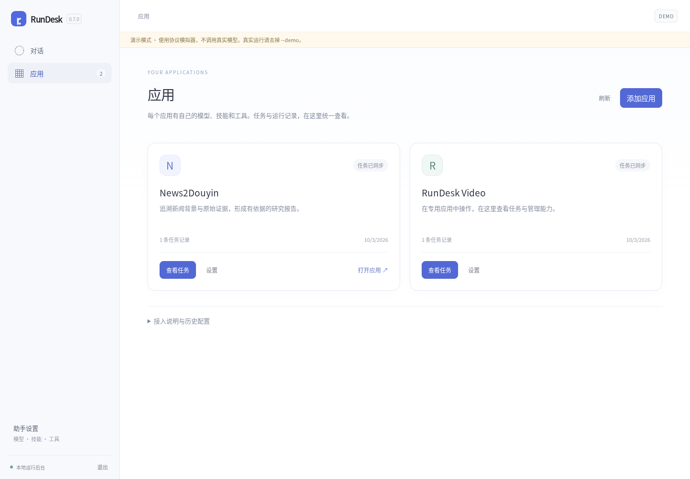
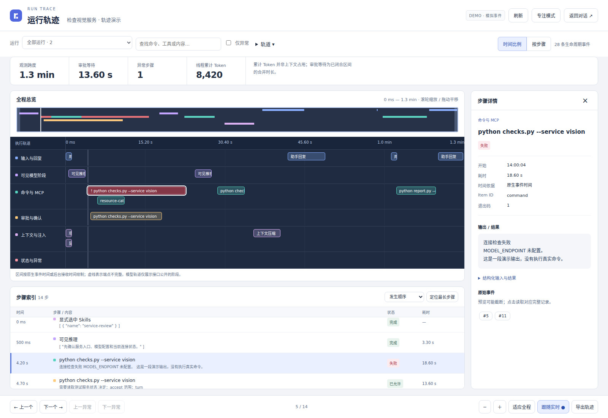

# RunDesk 0.7.0

首页直接使用通用助手；专用应用统一在「应用」页管理，一个应用对应一份专用配置。Skills 与 MCP 使用独立管理页。技能支持完整文件夹和 ZIP 导入、目录浏览与完整导出，脚本、参考资料、模板和资源文件一并保留。现有 `/api` 和 `/api/v1` 客户端继续兼容。

- [本版说明](docs/RELEASE-0.7.0.md)
- [验证记录](docs/VALIDATION-0.7.0.md)
- [0.6.0 API 与实例配置说明](docs/RELEASE-0.6.0.md)
- [应用 API v1](docs/API-V1.md)
- [OpenAPI 定义](internal/app/openapi.json)
- [Python 应用客户端](examples/application_client.py)

# RunDesk

一个轻量的 Codex 运行后台，使用 Go 编写，内嵌 Web 管理界面。

对话、Skills/MCP 配置、运行审批、调试事件与文件产物使用同一组 HTTP API。ActiveVLM 等业务前台可以通过这层 API 驱动 Codex。项目正式定名 RunDesk；当前尚未绑定 GitHub 仓库。

**状态：v0.7.0 原型。** 单用户、自托管。后端直接启动官方 `codex app-server`，没有复用 Sandbox Agent，也没有实现另一套 agent loop。



## 开始使用

需要 Go **1.25+** 和已安装、已登录的 Codex CLI。此前原生协议验证版本为 Codex **0.157.1**（本次 0.7.0 验证使用明确标识的协议模拟器）；较老版本的 App Server 方法可能不同。

```bash
codex login
go build -buildvcs=false -o bin/rundesk ./cmd/rundesk
./bin/rundesk
```

打开 **http://127.0.0.1:3210**。如果可执行文件不在 PATH 中：

```bash
./bin/rundesk --codex /absolute/path/to/codex
```

没有 Codex 或模型凭据时，可以先检查界面与协议流程：

```bash
./bin/rundesk --demo
```

演示模式有醒目的横幅，**不调用模型，不执行生成的命令**。输入“审批”可以检查确认流程；输入“审批 告警”可检查规则对象提交和重复告警合并；输入“轨迹 审批”可生成包含命令失败、MCP 和上下文压缩的模拟轨迹。演示规则不会写入真实 Codex。演示数据位于数据目录的 `demo/` 子目录，与真实模式隔离；模拟器的 MCP 配置与 Skill 开关保存在演示实例目录，跨连接与重启保留。

压缩包的 `bin/` 中若附带预编译版本，可直接运行对应文件：Linux x86-64 使用 `rundesk`，Windows x86-64 使用 `rundesk-windows-amd64.exe`。这些文件只包含本项目，不包含 Codex 或模型凭据。Windows 版本仅交叉编译，尚未进行 Windows 实机验证。

## 当前能力

| 能力 | 行为 |
| --- | --- |
| 助手与应用 | 通用助手直接对话；应用卡片、任务、名称和入口管理；各自配置模型、技能、工具与认证 |
| 对话 | 创建工作区/会话、搜索、重命名、置顶、归档/恢复、删除、Markdown 导出 |
| 运行 | 继续原生线程、模型选择、流式输出、停止任务 |
| 运行管理 | 每个会话单独一个 App Server 进程；关闭浏览器后继续运行 |
| 审批 | 按服务端选项显示本次/会话/命令规则批准；对象校验、决策记录；权限请求按轮或会话授权 |
| 权限 | 实例级沙箱、审批策略、审批处理方和网络覆盖；下一轮生效，运行中任务保持原配置 |
| 运行状态 | 生效模型/Provider/目录/权限；连接告警去重与原始错误；历史记录明确标记 |
| 轨迹工作台 | 全程总览、分层时间轴、按步骤排列、异常定位、原始事件详情、实时增量、刷新恢复和 JSON 导出 |
| 事件 | SQLite 持久化、SSE 重放、方向/分类/方法/关键词/时间筛选、历史分页、暂停显示、JSONL 导出 |
| Skills | 独立页面；完整目录/ZIP 导入、文件浏览、ZIP 导出；编辑 SKILL.md 保留附属文件；同名替换与移除完整备份 |
| MCP | stdio/HTTP 表单与 JSON 编辑、开关、版本冲突检测、合并导入/导出、状态与工具清单 |
| 项目记忆 | 可编辑笔记、版本检查、每轮显式注入、保留当时注入内容 |
| 调试 | 输入、实际 turn/start 参数、工具事件、耗时、Token 用量、原生压缩事件 |
| 诊断 | 本机帮助识别 CLI 格式，实际执行沙箱最小命令；保留命令/输出/退出码；配置/Skills/MCP 接口检查，无模型调用 |
| 文件 | 单文件 32 MiB 上传、图片作为 localImage 输入、产物列表、下载和安全预览 |

MCP 支持 stdio 的 `command/args/env` 和 HTTP 的 `url/bearer_token_env_var` 等字段。已有 `env` 和 `http_headers` 值在 UI 中隐藏，保留 `[redacted]` 会保留原值。修改写入 **Codex 用户配置**，也会影响使用该 CODEX_HOME 的其他客户端；项目/托管层配置仍可能覆盖它。保存后配置连接请求重载，各会话在下一轮运行前重载。导入默认拒绝覆盖同名服务；明确勾选后才覆盖，其他服务保留。导出会隐藏 env/http_headers 等结构化密钥；参数、URL 和任意文本中的敏感值仍需分享前检查。OAuth 初始登录目前请使用 Codex 自己的登录入口；本 UI 可响应运行中的 elicitation。

调试页展示的是 **App Server 提供的数据**。完整模型 HTTP 请求、系统上下文、隐藏推理和 Codex 内部记忆并不一定公开。项目笔记是本应用维护的明确文本，不声称等同于 Codex 原生记忆。`tokenUsage.total` 是累计用量，不应当成当前上下文占用。

## 通用助手与应用怎么用

1. 左侧「对话」直接进入通用助手，不需要选择 instance。通过「助手设置」管理模型、认证和项目记忆；Skills、MCP 会打开各自的独立管理页。
2. 「应用」页集中展示 news2douyin、RunDesk Video 等专用应用。进入卡片后查看任务，或分别管理模型、技能和工具。业务任务仍从应用自己的界面发起；已有任务可在 RunDesk 查看、补充和审批。
3. 每个应用固定绑定一份专用配置。可通过「添加应用」创建，或使用应用登记 API；这里不会安装或托管应用软件。接入信息展开后可复制 API 地址与所需编号。
4. 技能页「导入文件夹 / 导入 ZIP」接收一个完整技能，根部需要 `SKILL.md`，同时保留 `scripts/`、`references/`、`assets/` 等文件。浏览器文件夹上传会根据 shebang 恢复脚本可执行位；ZIP 导入/导出保留执行位。最多 1000 个普通文件、解压后 32 MiB，不接收链接或越界路径。
5. 「编辑 SKILL.md / 创建简单技能」默认折叠。编辑说明不会删除脚本或参考资料。完整替换需要明确勾选，替换或移除前将原目录放入 `.rundesk/skill-backups/`。不要把多个技能或整个源码仓库当成一个技能导入。
6. 专用技能保存到所属配置的 `CODEX_HOME/skills/`；项目技能保存到工作区 `.agents/skills/`，使用该目录的助手共享。MCP 修改对应配置的用户层，项目覆盖仍由 Codex 决定。独立配置不是操作系统隔离。
7. 升级时按历史 `source.appId` 自动归类归属明确的应用。无任务或归属冲突的旧配置在「应用 → 接入说明与历史配置」保留，可查看或登记，不会删除、搬迁或重新执行。旧默认配置中的应用任务也保留，并标明与通用助手共享配置。

**默认实例**继续使用启动服务时的 CODEX_HOME（缺省 `~/.codex`），用于兼容原有会话。不要在升级时更换服务用户或默认 CODEX_HOME。新实例保存在 `--data` 目录下；配置目录不开放修改和删除，避免丢失原生线程。

实例是配置身份，不是永久驻留的一个进程。会话仍各自使用 App Server；配置连接按「实例 + 工作区」复用，所有连接合计最多 16 个。重新加载只关闭空闲连接，运行和待审批任务保持原状。

这不是操作系统隔离。实例继续继承服务的普通环境变量，用户/系统全局 Skills、项目配置、项目文件及 OS 密钥环可能共享。新实例不继承 `CODEX_SQLITE_HOME` 覆盖，以免把原生数据库指向同一外部目录。凭据存储由 Codex 决定；独立 CODEX_HOME 不承诺独立系统密钥环账号。

权限在「助手设置 / 应用设置 → 模型与认证 → 高级运行权限」编辑，缺省保持 workspace-write / on-request / user；网络沿用 Codex 配置。修改在各会话下一轮通过新进程恢复原 thread 后应用，不改写 config.toml。服务端管理要求优先，拒绝配置时会显示错误，不回退为更宽权限。`never` 仅停止请求审批，不等于允许沙箱外操作。完整访问会移除沙箱边界。自动审查需要 Codex 与模型支持。

对话标题下的「查看运行配置」展示 App Server 实际返回值；未返回的字段明确标记未知。旧连接告警只是历史记录，不等同于当前故障。诊断沙箱固定使用 workspace-write + 禁网，即使实例选择完整访问也不会把无沙箱执行当作通过。

点击顶栏「轨迹」进入独立工作台。支持历史会话，直接投影原有事件，无需重新运行任务。步骤列表可按耗时从长到短排序，或点击「定位最长步骤」；时间轴仍保持发生顺序。使用说明见 [轨迹工作台](docs/TRACE.md)，设计与边界见 [设计记录](docs/TRACE-DESIGN.md)。



Ubuntu 安装和升级见 [Ubuntu 指南](docs/UBUNTU.md)。

## 部署与数据

```bash
./bin/rundesk --listen 127.0.0.1:3210 --data /path/to/rundesk-data
```

新安装的默认数据目录是操作系统用户配置目录下的 `rundesk/`。如果未发现 RunDesk 数据，但存在旧版 `codex-base/` 数据，直接继续使用旧目录，不移动工作区。也可以显式指定 `--data`。其中包括：

```text
state.db              # 实例、会话、笔记、审批和事件；SQLite WAL
instances/<id>/codex/  # 新实例的配置、Skills、原生线程等 Codex 状态
server.lock           # 防止两个服务同时打开该数据目录
workspaces/<id>/      # 没有指定已有路径时创建的工作区
```

每个工作区包含 `uploads/`、`outputs/<session-id>/`，以及用户创建的 `.agents/skills/`。原生 Codex 线程仍保存在 Codex 管理的数据目录中；要完整备份，两侧都需要备份。停止后台后再复制数据库目录，避免遗漏 WAL 内容。数据没有应用层加密。

后台重启会把未结束任务标记为中断，审批失效，**不会自动重新执行任务**。再次发消息会通过原有 thread ID 恢复。异常断电可能留下 `server.lock`；确认旧进程确实停止后，才手动删除该文件。不得将两个服务指向同一数据目录。默认最多加载 16 个会话/配置连接，空闲 10 分钟回收。

远程监听必须设置至少 24 字符的访问令牌；通过 TLS 反向代理提供 HTTPS：

```bash
export RUNDESK_TOKEN='replace-with-a-long-random-secret'
./bin/rundesk --listen 127.0.0.1:3210 --public-url https://codex.example.com
```

Web 登录使用 HttpOnly、SameSite=Strict Cookie；API 客户端使用 `Authorization: Bearer ...`。`--public-url` 是固定的 HTTPS 公网来源，不带路径或末尾斜线；它允许 TLS 在反向代理终止，同时保持严格的 Origin 检查与 Secure Cookie。反向代理应保留 Host，关闭 SSE 缓冲，且只转发到此后台。应用不会信任任意客户端发送的转发头。

默认不开放跨域 CORS。ActiveVLM 的浏览器前端可以由其服务端代理这组 API，或与本后台部署在同一来源。

## 开发与验证

运行时不需要 Node.js、前端构建服务或外部数据库。HTML/CSS/JS 随 Go 二进制嵌入。SQLite 使用纯 Go 驱动，可关闭 CGO 构建。

```bash
go test ./...
go test -race ./...          # 当前平台需要支持 race 的 Go 环境
go vet ./...
node scripts/trace-model-test.cjs
python3 scripts/native-smoke.py --codex /path/to/codex
```

浏览器测试可选：在开发环境安装 Playwright 和 Chromium，然后运行 `node scripts/product-smoke.cjs`。Node/Playwright 只用于测试，不是 RunDesk 运行依赖。完整验证范围与复现命令见 [0.7.0 验证记录](docs/VALIDATION-0.7.0.md)。

原生协议 smoke 测试使用临时 `CODEX_HOME`，验证配置、Skills 和 MCP，不请求模型推理，不修改已有 Codex 配置。

目录：`internal/rpc` 是 JSONL 客户端；`internal/app` 是会话协调、配置和 HTTP API；`internal/store` 是 SQLite；`internal/web` 是内嵌前端；`cmd/rundesk` 是启动入口。

从 v0.1 / v0.2 / v0.3 / v0.4 升级请先阅读 [升级说明](docs/UPGRADING.md)；本版改动见 [CHANGELOG](CHANGELOG.md)。

参见 [API 文档](docs/API.md)、[架构和边界](docs/ARCHITECTURE.md)、[验证记录](docs/VALIDATION.md) 与 [安全说明](SECURITY.md)。仓库创建后将 `go.mod` 和内部 import 中的占位 module 路径替换为实际 GitHub 路径。

## 暂未覆盖

多用户权限与隔离、容器调度、配额、任务队列、Cron、HTTP 幂等提交键、对已有 Codex 原生历史的批量导入、全量原生记忆管理、任意 MCP 工具的独立交互测试、完整富文本编辑器、自动更新和生产运维。后端终止 Codex 后，其外部工具进程的清理行为依赖操作系统和 Codex，生产部署建议使用服务管理器/容器管理整个进程树。

本版本适合作为可运行的开发起点；不建议直接作为公网多租户服务。

## 协议与许可

- [Codex App Server 文档](https://learn.chatgpt.com/docs/app-server)
- 项目代码：MIT，见 [LICENSE](LICENSE)。
- Go 依赖保留各自许可证，见 [THIRD_PARTY_NOTICES.md](THIRD_PARTY_NOTICES.md)。
- Codex 是独立安装的外部组件。本项目不附带 Codex，也不代表 OpenAI 官方项目。使用模型服务仍受其服务条款约束。
