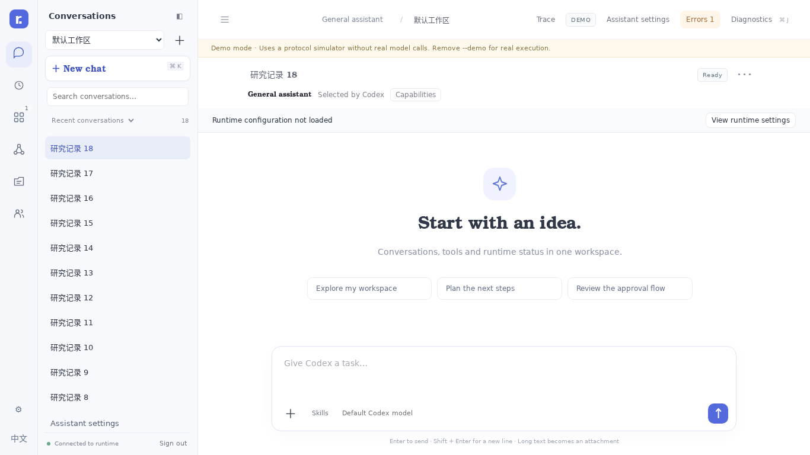

# RunDesk

**A lightweight workspace for agent conversations and application agents.**

[English](README.md) · [简体中文](README.zh-CN.md)

RunDesk gives people a web conversation interface and gives applications an API to run Codex tasks. Review tool activity, manage skills and MCP connections, and keep application runs visible in one place.

Built with Go and plain HTML/JavaScript. Node.js is not required to run RunDesk itself. Your Codex installation or tools may have their own dependencies.



## Kun and Codex debugging (0.30.0)

RunDesk 0.30.0 connects Kun diagnostic steering suggestions to administrator review: edit the text, preview the current run and revision, explicitly send it, and inspect queued/applied/rejected receipts. Stale previews are rejected; retries of the same preview reuse the worker command ID. Diagnostic models still expose only six trace queries and one suggestion formatter, without control tools. Kun stays at 0.7.0 / worker protocol v7; there is no engine-version change from 0.29.0. Codex keeps its native analysis path; internal stepping, conditional breakpoints and full context snapshots remain unavailable. See [diagnostic setup](docs/KUN-DIAGNOSIS.md), [validation](docs/KUN-VALIDATION.md) and [progress](docs/KUN-PROGRESS.md).


Kun shares this repository with RunDesk and runs in a separate worker process. Build with Go 1.25.12+ using `make build`, then launch `./bin/rundesk --data ./data`. Open **Agent engine** in configuration, select Kun, configure an OpenAI-compatible endpoint/model, and create a new session. Codex is not required for Kun.

Kun 0.6 supports text model calls, workspace file tools, explicit Skills, and MCP over stdio or finite Streamable HTTP. Configure MCP in the existing tools page: rules default to per-call approval; an explicit always-allow rule applies to the next run. DevTools shows Network, Elements, Sources, Performance, Console, Layers and MCP state in Application. Pause, step, supplemental instructions and cancellation are available. Plugins, historical rollback, forks and trajectory compilation remain unimplemented.

See [Kun implementation and limits](docs/KUN.md). Thanks to PiG and Pi contributors: selected source files, pinned revision, adaptations and preserved MIT licenses are recorded in [UPSTREAM.md](docs/UPSTREAM.md).

## Codex quick start

1. Install Codex and configure its authentication or model provider. See the [official Codex CLI documentation](https://developers.openai.com/codex/cli/).
2. Extract a RunDesk release. On Linux:

   ```bash
   chmod +x bin/rundesk
   ./bin/rundesk --data ./data
   ```

   On Windows, run `bin\rundesk-windows-amd64.exe --data .\data`.
3. Open **http://127.0.0.1:3210**. On a fresh installation, setup opens automatically. Review the Codex path, select a working project and default model, save, and run the relevant checks.
4. Start a conversation. Switch English / Chinese using the language button at the bottom left.

The service must be able to find Codex. You can supply `--codex /absolute/path/to/codex` or save the executable in setup. The saved setup path takes precedence. Existing Codex provider and authentication settings are used by default; the default assistant follows the service's `CODEX_HOME` (otherwise `~/.codex`).

The setup dialog remains available through **Environment check**. Missing Codex does not prevent the configuration page from opening. A successful protocol check is not a successful model inference test. Docker and MCP diagnostics show their own results rather than a blanket “ready” status.

### Try the interface without a model

```bash
./bin/rundesk --demo --data ./demo-data
```

Demo mode uses a protocol simulator and isolated data. It does not verify real authentication, model calls or container execution.

## How it works

| Area | Purpose |
|---|---|
| Chat | General assistant running native Codex; a dedicated, resizable conversation list |
| Applications | Application-initiated registration, task history and administrator configuration |
| Tasks | Queued work and schedules |
| Files | Personal uploaded and generated files |
| Collaboration | Coordinator-led delegation, direct interaction or an optional Gitea blackboard |
| Environment check | Codex, working directory, protocol, account, MCP and optional Docker checks |

RunDesk talks to Codex **app-server**. For managed Docker environments it starts app-server through `docker exec -i` and uses stdio, without exposing an app-server network port.

## Connect an application

Connect from the application, supplying the RunDesk URL and administrator credential. Applications such as news2douyin and rundesk-video-app use:

```text
POST /api/v1/applications/{appId}/connect
```

RunDesk creates or reuses the application's binding. Initial skills and MCP settings are seeded once; reconnecting does not overwrite administrator changes. Applications automatically appear under **Applications**, where tasks and conversations are visible. Use scoped application credentials for supported ongoing task operations; initial registration remains an administrator operation.

See [application integration](docs/APPLICATION-CONNECT.md) and the [API reference](docs/API-V1.md). RunDesk does not start or install the business application itself.

## Optional Docker runtime

The general assistant uses native Codex. Applications can be configured to use Docker on a Linux host with a local Docker engine.

The fixed template directory is **[`examples/docker/`](examples/docker/README.md)**. To build manually:

```bash
# Replace X.Y.Z with your verified Codex release.
bash examples/docker/build.sh X.Y.Z
```

Or open an application's **Configuration & runtime → Images & builds → Build tasks → Use base template**. Enter the Codex version to create a build draft, inspect it, then start the build. Select the resulting image and update project environments explicitly.

A successful build does not automatically change a running application. Registration still defaults to local Codex; automatic Docker provisioning on registration is not included in this release. Data is mounted from the host. Environments are isolated by application and workspace, not automatically by individual user.

See [Docker environments](docs/DOCKER-ENVIRONMENTS.md), [images](docs/IMAGES.md) and [builds](docs/BUILDS.md).

## Models, credentials and data

- Keep your existing Codex configuration, or set the assistant's default model during setup.
- Advanced setup can configure a custom **Responses API-compatible** provider. The API key is referenced by a service environment variable; it is not entered into the setup page. Restart the service after changing its environment. Saving the provider changes native Codex configuration for the general assistant.
- `--data` chooses the persistent database, managed workspaces and application state directory **before startup**. Setup shows this path; it does not move live data.
- Working directories can be added from setup. Paths are on the server, not the browser's computer.
- Keep credentials out of image layers and build ZIPs. A container's `localhost` refers to that container, so application MCP URLs must be reachable from inside it.

## Remote access

Local loopback access is the default. Remote listening requires an administrator token of at least 24 characters:

```bash
export RUNDESK_TOKEN='replace-with-a-long-random-secret'
./bin/rundesk --listen 0.0.0.0:3210 --data ./data
```

Use HTTPS for remote deployment. Behind a reverse proxy, set `--public-url https://rundesk.example.com`. Existing authentication protects setup; there is no publicly accessible installation bypass. Configure the initial token through the service environment.

## Build from source

Use a Go toolchain compatible with `go.mod`:

```bash
go build -o bin/rundesk ./cmd/rundesk
go test ./...
```

Frontend assets and the Docker template are embedded in the executable. Rebuild after changing them. No frontend build step or Node.js runtime is needed for deployment. Browser smoke tests use Playwright as a development-only dependency.

## Upgrade and limits

Stop the service and back up the existing data directory and Codex configuration before replacing binaries. Keep the same `--data` location. Existing applications and conversations are preserved.

Version **0.19.4** adds a discovered MCP tool list with per-tool default, allow, prompt and disable choices. It retains queued-task credential re-checks from 0.19.2. It retains application/project ownership checks for files from 0.19.1. Uploads without recorded ownership must be uploaded again through the application/member endpoint; administrators retain access. It includes the native process cleanup, kernel-backed data locks, runtime-process view and systemd example from 0.19.0. It retains the bilingual interface and environment setup introduced in 0.16. Technical logs and user/model content remain in their original language. Some legacy detailed diagnostic messages retain their original wording.

This patch is checked with automated Go tests, focused race tests and MCP approval-editor browser scenarios. The packaged Docker template has not been built against a real Docker engine in the development environment; real model/provider and container deployments require local verification. See [release notes](docs/RELEASE-0.19.4.md).

[License](LICENSE)

## MCP test workbench (0.17)

Open **Assistant settings → MCP → MCP test workbench** (or the application's MCP settings). Select a configured server, confirm direct-call access, load its tool list, inspect the schema, enter a JSON object, and execute. The result includes duration, protocol/transport errors and `isError` tool failures. **Replay record only reads saved data**; Execute tool makes a new real call.

Local stdio and handshake-era Streamable HTTP (2025-03-26 / 2025-06-18 / 2025-11-25) are supported. Each test gets a new connection with a 30-second timeout and a 2 MiB response limit. This does not claim support for every MCP extension or the 2026 stateless protocol. Docker execution, OAuth login and server-initiated sampling/elicitation are not implemented. No host fallback is made for container applications. Only administrators may use this workbench. A disabled server can be tested explicitly without changing its enabled state; configured tool allow/deny lists still apply.

Direct tests run with RunDesk's service identity, outside Codex's sandbox and approval flow. No credentials are accepted in the test form; existing server configuration is reused. Known configured secrets and common secret fields are masked, but arbitrary sensitive free text cannot be detected reliably. Saved test history can be deleted; idempotency receipts remain to prevent accidental re-execution. A timeout does not prove an external action failed or was cancelled.

## Idempotent API submissions

This capability already existed before 0.17. Send a stable `Idempotency-Key` (8–128 characters) for each logical POST to `/api/v1/tasks`, `/sessions`, `/sessions/{id}/turns`, or `/workspaces/{id}/mcp-tests`. Retry the **same request with the same key**; changed content returns 409. Keys are scoped to the authenticated caller. `Idempotency-Replayed: true` identifies a persisted acknowledgement, not current task status. Inspect `GET /api/v1/requests/{key}` or the task resource after a timeout. An interrupted acknowledgement can return `request_unconfirmed`; reconcile actual effects instead of changing keys and resubmitting. This is duplicate-submission protection, not an exactly-once guarantee for external tools.

[Capability status and next steps](docs/CAPABILITY-STATUS-0.19.2.md)

## Usage by application and project (0.18)

Open **Tasks → Usage**. Pick dates (browser timezone, inclusive end date), application and project. The administrator-only `GET /api/v1/usage` API uses an inclusive `from` and exclusive `to` in RFC3339, with a maximum 366-day window. Export the displayed snapshot as JSON.

Counters are **observed positive increments** of `thread/tokenUsage/updated.tokenUsage.total`, deduplicated per configuration identity and native thread. The first snapshot of a newly started thread is counted; an unknown/resumed baseline is excluded until another snapshot establishes an increment. Lower counters are flagged and ignored, not treated as a new spend period. Cached input and reasoning output are subsets, not additional totals. Missing fields remain `null`/Unknown. These are provider/runtime-reported observations, not prices, billing records, context occupancy or enforced quotas.

Token increments belong to event receipt time. Runs belong to their start time; status is the latest recorded status before the selected end. “Reported” means a run has a usable total snapshot, not that all usage was reported. Details expose missing counters, unknown baselines and regressions. Events arriving late or spanning a reporting boundary can shift attribution between periods.

The report reads retained session events only. Deleting sessions removes their usage; outside-Codex work and MCP direct tests are not measured. It does not infer CPU, storage or monetary cost. Queries are bounded to 10 seconds and 200,000 relevant lifecycle events; an exceeded limit returns an error instead of a partial total. This is an initial single-host observability view, not a scalable billing ledger.

## Service operation and process cleanup (0.19)

**Tasks → Runtime processes** lists managed App Server connections with PID, application/project, start time and cleanup scope. `GET /api/v1/processes` is administrator-only. It does not enumerate every OS descendant, build or MCP-test process. Docker entries identify the host docker-exec client; existing container leases remain responsible for in-container execution.

On Linux/macOS each RPC connection owns a private process group. Closing the connection, malformed protocol or parent exit terminates that group. Buffered output is drained with a one-second bound after parent exit, preventing descendant-held pipes from hanging shutdown. This can end background commands started by that Codex connection. Processes that call setsid/change groups, privileged processes or remote services are outside this guarantee. Abruptly killing RunDesk itself cannot run its cleanup code. Windows currently terminates the direct App Server process only; Job Objects are not implemented.

The standalone server now uses an OS-held data-directory lock (Linux/macOS flock, Windows LockFileEx). It is released when the process exits, including crashes. **The persistent `server.lock` file is normal: never delete it while a server may be running.** Existing v0.18-and-earlier locks are not overwritten: stop the old service; normal shutdown removes its old lock. Only if an old-format stale file remains, confirm the old server has stopped and remove that file once. Downgrading also requires stopping v0.19 before removing its persistent lock. Use local filesystems with working kernel-lock semantics, not an unverified shared/network filesystem.

A [bilingual systemd user-service example](examples/systemd/README.md) configures restart-on-failure and service-cgroup cleanup. Review its data path and environment before installation; nothing is installed automatically. Interrupted tasks are not automatically replayed when the service restarts.
