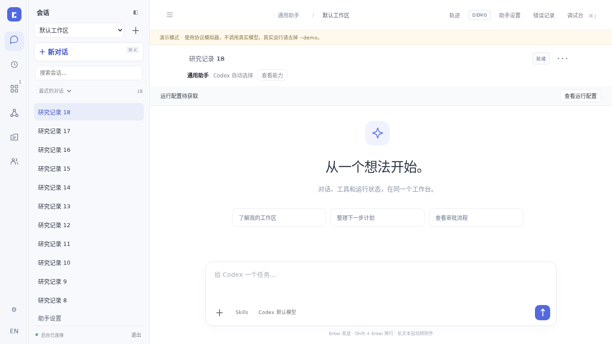

# RunDesk

**面向日常对话和应用 Agent 的轻量 Agent 工作台。**

[English](README.md) · [简体中文](README.zh-CN.md)

人通过网页与通用助手交互，应用通过 API 提交任务。RunDesk 集中展示对话、工具过程和运行状态，并管理 Skills、MCP 和应用运行环境。

采用 Go + 原生 HTML/JavaScript，运行 RunDesk 本身不需要 Node.js。Codex 的安装方式和第三方工具可能有各自的依赖。



## Kun 离线实验与调试（0.31.0）

RunDesk 0.31.0 开始 K3-A：冻结 Kun 单个轮次的记录，建立不可变实验分支，查看来源谱系和记录差异。管理员可假设工具返回另一段文本；后续记录保守标为未验证。这些操作不调用模型或工具、不重新生成答案，也不改变来源会话。实验能在宿主重启和来源删除后继续查看；当前尚无实验删除或过期接口。见 [离线实验说明](docs/KUN-EXPERIMENTS.md)、[验证记录](docs/KUN-VALIDATION.md) 和 [完成度](docs/KUN-PROGRESS.md)。

Kun 维持 0.7.0 / 协议 v7，保留既有诊断建议审核。检查点运行时分叉、Hybrid/Live 和 K4 优化尚未实现。Codex 保留只读检查与原生分析路径，内部单步、条件断点和完整上下文快照仍未提供。

Kun 与 RunDesk 同仓库、分进程运行。使用 Go 1.25.12+ 执行 `make build`，然后运行 `./bin/rundesk --data ./data`；在配置页的 **Agent 引擎** 中选择 Kun、设置模型服务并新建会话。Kun 不需要安装 Codex。

Kun 0.7 提供 OpenAI 兼容文本模型、项目文件工具、显式 Skills，以及 stdio / Streamable HTTP MCP。复用工具 MCP 配置页：默认逐次询问，设为“始终允许”后下一轮直接执行。DevTools 包括 Network、Elements、Sources、Performance、Console、Layers 和 MCP 状态 Application 视图。支持暂停、单步、文本补充和停止。插件、任意历史回滚、运行时分叉和轨迹编译尚未实现；宿主已提供离线记录分支。

详见 [Kun 使用与实现边界](docs/KUN.md)。选择性复制的 PiG 源码、固定版本及感谢声明见 [来源记录](docs/UPSTREAM.md)；MIT 许可与版权声明随源码保留。

## Codex 快速开始

1. 安装 Codex，完成登录或模型服务配置。参考 [Codex 官方文档](https://developers.openai.com/codex/cli/)。
2. 解压发行包。在 Linux 中运行：

   ```bash
   chmod +x bin/rundesk
   ./bin/rundesk --data ./data
   ```

   Windows 运行 `bin\rundesk-windows-amd64.exe --data .\data`。
3. 打开 **http://127.0.0.1:3210**。新安装自动打开初始化页面，确认 Codex 路径、工作项目和默认模型，保存后逐项检查。
4. 开始对话。左下角语言按钮可以切换中文和英文。

服务进程需要能找到 Codex。可以指定 `--codex /绝对路径/codex`，也可以在初始化页面保存路径；已保存的路径优先。默认沿用现有 Codex 的模型提供方与认证配置。通用助手跟随服务进程的 `CODEX_HOME`，未指定时使用 `~/.codex`。

以后可通过左下角的「环境检查」重新进入。没有安装 Codex 也能打开配置页。协议检查成功不等于模型推理成功；Docker、认证和 MCP 分项显示结果，不笼统标为“可运行”。

### 不调用模型，先体验界面

```bash
./bin/rundesk --demo --data ./demo-data
```

演示模式使用协议模拟器和独立数据目录，不验证真实账户、模型服务或容器执行。

## 界面与职责

| 入口 | 用途 |
|---|---|
| 对话 | 本机 Codex 通用助手；独立、可调整宽度的会话列表 |
| 应用 | 应用主动接入、任务记录、管理员配置 |
| 任务 | 后台任务队列与定时执行 |
| 我的文件 | 个人上传和生成的文件 |
| 协作 | 负责人委派与结果回收；直接交互或可选的 Gitea 黑板 |
| 环境检查 | Codex、目录、协议、认证、MCP，以及可选 Docker 检查 |

RunDesk 通过 Codex **app-server** 工作。管理 Docker 环境时，以 `docker exec -i` 启动 app-server，通过 stdio 通信，不暴露额外服务端口。

## 接入应用

在 news2douyin 或 rundesk-video-app 中填写 RunDesk 地址与管理员凭据，由应用调用：

```text
POST /api/v1/applications/{appId}/connect
```

RunDesk 创建或复用绑定，应用自动出现在「应用」页。初始 Skills 和 MCP 只写入一次，重连保留管理员修改。任务和对应会话在 RunDesk 可见。后续业务操作可使用受限的应用凭据；首次注册仍是管理员操作。

参考 [应用接入说明](docs/APPLICATION-CONNECT.md) 和 [API 文档](docs/API-V1.md)。RunDesk 不负责安装或启动业务应用本身。

## 可选 Docker 环境

通用助手使用本机 Codex。应用可以切换到 Linux 主机上的本地 Docker 环境。

基础模板固定放在 **[`examples/docker/`](examples/docker/README.md)**：

```bash
# X.Y.Z 替换成已验证的 Codex 数字版本
bash examples/docker/build.sh X.Y.Z
```

也可进入「应用 → 配置与运行环境 → 镜像与构建 → 构建任务 → 使用基础模板」，填写 Codex 版本，生成待启动的构建记录；检查后开始构建，再选择镜像版本、更新项目环境。

构建成功不会自动替换运行中的应用。当前应用自动注册仍默认使用本机 Codex，本版未实现注册时自动创建 Docker 环境。数据挂载在宿主机。隔离单位是应用与工作项目，不会自动按用户分别创建容器。

参考 [Docker 环境](docs/DOCKER-ENVIRONMENTS.md)、[镜像管理](docs/IMAGES.md) 和 [构建说明](docs/BUILDS.md)。

## 模型、认证和目录

- 默认沿用现有 Codex 配置，可在初始化页设置通用助手的默认模型。
- 高级设置支持兼容 **Responses API** 的自定义模型服务。填写密钥的环境变量名称，密钥通过服务进程环境提供；环境变化后重启服务。保存模型服务会修改通用助手的原生 Codex 配置。
- `--data` 在启动前决定数据库、托管工作区和应用状态的位置；初始化页面仅显示，不迁移运行中的数据目录。
- 可以添加工作目录；这里的路径属于服务器，不是浏览器所在电脑。
- 登录文件、密钥和业务数据不放入镜像或构建 ZIP。容器中的 localhost 指向容器自身，应用 MCP 地址必须能从容器访问。

## 远程访问

默认仅监听本机。远程监听需要至少 24 字符的管理员令牌：

```bash
export RUNDESK_TOKEN='替换为足够长的随机密钥'
./bin/rundesk --listen 0.0.0.0:3210 --data ./data
```

远程部署使用 HTTPS。反向代理部署可配置 `--public-url https://rundesk.example.com`。初始化沿用现有管理员认证，没有匿名安装后门。首次管理令牌从服务进程环境中设置。

## 从源码构建

使用满足 `go.mod` 要求的 Go 工具链：

```bash
go build -o bin/rundesk ./cmd/rundesk
go test ./...
```

前端和 Docker 模板嵌入可执行程序，修改后需重新编译。部署不需要前端打包步骤或 Node.js。浏览器测试使用 Playwright，仅用于开发验证。

## 升级和验证范围

停止旧进程，备份数据目录及 Codex 配置，再替换程序。继续使用原来的 `--data`，保留已有应用和会话。

**0.19.4** 增加 MCP 工具列表与逐项默认／允许／询问／禁用选择，保留排队任务授权复核，并保留 0.19.1 的文件归属校验。没有归属记录的旧上传文件需通过应用或成员入口重新上传，管理员仍可访问。包含 0.19.0 的原生连接进程组清理、系统级目录锁、运行进程视图和 systemd 示例，保留 0.16 的中英文界面与环境初始化。用户内容、模型回复与技术日志保留原文，部分旧版详细诊断信息仍保留原有措辞。

本补丁执行 Go 自动化测试、针对性竞态测试及MCP 审批编辑器浏览器验证。开发环境没有真实 Docker 引擎，未实际构建基础镜像；真实模型服务与容器运行需要在部署环境验证。详见 [版本说明](docs/RELEASE-0.19.4.md)。

[许可协议](LICENSE)

## MCP 独立测试台（0.17）

进入 **助手设置 → MCP → MCP 独立测试台**，或应用对应的 MCP 设置页。选择已配置服务器，确认直接调用权限，读取工具列表，查看参数结构，填写 JSON 对象并执行。结果包含耗时、协议／连接错误和工具 `isError` 状态。**回放记录只读取历史，不会重新执行**；再次点击执行才会发起新的真实调用。

支持本机 stdio 和 2025-03-26／2025-06-18／2025-11-25 握手版本的 Streamable HTTP；每次测试独立连接、30 秒超时、响应上限 2 MiB。不声称覆盖任意 MCP 扩展或 2026 无状态协议。暂不支持 Docker 内执行、OAuth 登录和服务器发起的 sampling／elicitation，容器应用不会回退到宿主机执行。仅管理员可使用。允许显式测试已关闭的服务器，不修改启用状态；工具允许／禁用清单仍然有效。

直接测试使用 RunDesk 服务账户，**不经过 Codex 沙箱与审批**。测试表单不接收密钥，复用已配置的认证。会屏蔽已知配置密钥和常见敏感字段，但无法可靠识别任意文本中的机密。可以删除测试历史；防重复执行的 API 回执仍保留。超时不代表外部操作没有成功，也不保证远端已取消。

## HTTP 幂等提交

此能力在 0.17 之前已经实现。向 `/api/v1/tasks`、`/sessions`、`/sessions/{id}/turns` 或 `/workspaces/{id}/mcp-tests` 提交时，为每个逻辑操作提供固定的 `Idempotency-Key`（8–128 字符）。**同一次请求重试复用相同 Key**，同 Key 不同内容返回 409。不同调用身份的 Key 相互隔离。`Idempotency-Replayed: true` 表示回放持久化回执，不代表任务当前状态。超时后通过 `GET /api/v1/requests/{key}` 或任务接口核对。服务中断留下 `request_unconfirmed` 时，应核对实际副作用，不要更换 Key 重发。这防止重复提交，不承诺外部工具严格执行一次。

[能力状态与后续待办](docs/CAPABILITY-STATUS-0.19.2.md)

## 按应用与项目统计用量（0.18）

进入 **任务 → 用量统计**，选择日期（浏览器本地时区，包含结束日）、应用和项目，可导出当前 JSON 快照。仅管理员可访问 `GET /api/v1/usage`；API 的 `from` 包含、`to` 不包含，使用 RFC3339，最长查询跨度 366 天。

采用 `thread/tokenUsage/updated.tokenUsage.total` 的**已观测正增量**，按配置身份与原生线程去重。已知新建线程的首个快照可计入；未知／恢复线程的首值仅建立基线，后续增量才计入。累计值回退会标记异常并忽略，不擅自视为新计费周期。缓存输入、推理输出是子集，不再重复加到总量。缺失字段保留 `null`／未知。这是运行时上报的观测值，不是价格、账单、上下文占用或硬性配额。

token 按事件收到时间归属，执行轮次按启动时间筛选；状态为截止时间前最后一次记录。“有上报”只表示该轮取得可用的总量快照，不证明全部用量完整。展开行可看起始值未知、缺失和回退情况。延迟上报及跨统计边界的增量可能影响期间归属。

只统计保留的会话事件，删除会话会移除相应用量；不统计 Codex 外的工作或 MCP 直接测试，也不推测 CPU、存储或费用。查询限制为 10 秒、20 万条相关生命周期事件，超过限制明确报错，不返回残缺总数。当前是单机可观测性功能，不是大规模计费账本。

## 服务运维与进程清理（0.19）

**任务 → 运行进程** 显示已登记 App Server 连接的 PID、应用／项目、启动时间和清理方式。`GET /api/v1/processes` 仅管理员可读，不枚举全部操作系统子进程、构建或 MCP 测试进程。Docker 行显示宿主机 docker exec 客户端，容器内部继续由既有租约机制负责。

Linux／macOS 的每个 RPC 连接拥有独立进程组。关闭连接、协议异常、父进程退出时清理该组；父进程退出后，输出最多继续排空一秒，避免后代占着管道导致关闭挂起。这也会终止由该 Codex 连接启动并留在组内的后台命令。自行 setsid／换组、特权进程和远端服务不在保证内；RunDesk 本身被强杀时也无法执行清理代码。Windows 目前只终止直接 App Server 进程，未实现 Job Objects。

独立服务入口改用操作系统持有的数据目录锁（Linux／macOS flock，Windows LockFileEx），退出或崩溃后自动释放。**`server.lock` 文件长期保留是正常现象，服务可能运行时切勿删除它。** 不覆盖 v0.18 及更早版本的旧格式锁：先停止旧服务，正常退出会移除旧锁；只有确认旧进程已经停止但遗留旧格式文件时，才手工删除一次。降级也要先停止 v0.19，再处理保留的锁文件。使用支持可靠内核锁的本地文件系统，未验证共享／网络文件系统。

提供 [中英文 systemd 用户服务示例](examples/systemd/README.md)，配置故障重启和服务 cgroup 清理。安装前核对原数据路径及环境变量，不会自动修改你的系统。服务重启不会自动重放未确认任务。
