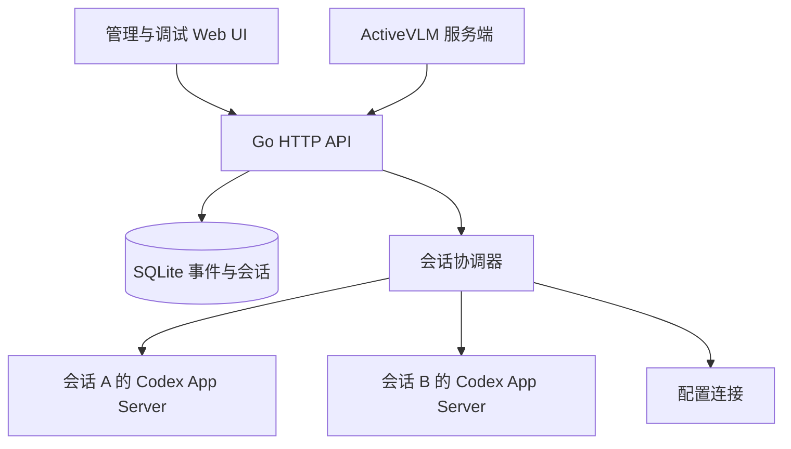

# Architecture

管理界面是内嵌静态资源，不需要独立 Node 服务。ActiveVLM 与管理 UI 使用相同 HTTP API。应用后端承担进程/会话协调、配置入口、审批路由、事件留存和文件入口。

Codex 自己承担模型调用、agent loop、原生上下文压缩、工具调度、Skills/MCP 执行、原生线程保存与沙箱。项目笔记只是显式应用输入。没有通过“兼容 OpenAI chat/completions”重新实现 Codex。

## 生命周期

1. 创建应用会话，固定保存 instanceId、workspaceId、模型等元数据；不立即执行任务。
2. 提交输入：验证附件/技能；保存 run ID、输入与当时的笔记版本。
3. 启动或复用此会话的 App Server 子进程；initialize → initialized。
4. 新会话 thread/start；旧线程在新进程中 thread/resume；同一个活跃连接直接复用已加载线程。
5. 请求 MCP 配置重载，再发送 turn/start。保留原生请求/响应与通知。
6. 原生请求需要人工输入时保存审批，UI 响应只回到所属进程。
7. turn/completed 更新状态。连接保留供后续轮次使用，空闲连接会回收。

限制为 16 个实际加载的会话/配置连接；会话重命名、置顶等元数据操作不占用进程额度。达到上限返回错误，没有隐式排队或丢弃任务。配置调用也有独立连接，按 instanceId + workspaceId 复用。

运行状态有 idle/starting/running/waiting/stopping/completed/interrupted/failed；未知原生最终状态会按原值保留。关闭浏览器只断开事件流。停止任务调用 turn/interrupt；启动中停止可终止此会话进程。后台退出/崩溃不会保证模型任务继续，也不会在恢复后重跑。

## 可靠性边界

- JSONL 请求 ID 与并行响应配对；按行读取，单帧最大 32 MiB，支持超过默认 Scanner 大小的工具输出。
- 原生 JSON envelope 不添加 jsonrpc 字段。对未知 server request 返回方法未实现错误，不猜测批准。
- SQLite WAL 保存递增事件 ID；SSE 从数据库读取，慢浏览器不会直接阻塞 App Server 读循环。
- 原生事件落库仍位于读取路径，因此磁盘速度影响读取吞吐；该版本没有吞吐优化或日志配额。落库失败触发管理器停止。
- 单个 session 只允许一个在途任务；并行任务使用不同 session。
- 启动时间和 RPC 超时有上限；长时间模型生成不因 turn/start 返回后而被 90 秒计时器取消。
- 重启恢复时所有未完成任务成为 interrupted，原来的审批成为 expired。原生线程是后续继续会话的依据。
- 配置写入使用原生 expectedVersion；用户层 MCP 整表写入前保留其他服务。存在配置层覆盖时以 Codex 原生有效配置为准。

## 下一步可独立演进

将管理 API 版本化并增加幂等键、将多个工作区映射到独立 OS/容器身份、增加任务队列与容量控制、为日志建立脱敏与保留策略、加入 MCP OAuth/测试工具 UI、完善 Codex 版本协商。业务界面与模型能力保持在 ActiveVLM 等上层应用中。

## v0.2 管理功能

会话置顶和归档作为原有 JSON 记录中的可选字段追加，不重建数据库或移动目录。删除会话通过 SQLite 事务清理应用元数据、审批和事件，先关闭其原生连接并等待输出完成。上传和产物保留。

事件过滤在 SQLite 执行，不局限于浏览器已缓存的事件；UI 将实时视图与历史查询区分。暂停只冻结显示。MCP 导入在版本检查和所有服务校验通过后，使用一次原生整表写入；编辑和导入共用配置校验与密钥占位符处理。

## v0.3 实例配置身份

Instance 保存名称、用途、默认模型和固定 CodexHome；Session 绑定 Instance 与 Workspace。一实例可以用于多个工作区，一个工作区也可供多实例使用。Workspace 继续保存项目路径和项目笔记；它不是账号或配置隔离身份。

默认实例沿用服务启动环境。新实例使用 `data/instances/<id>/codex`；子进程设置 CODEX_HOME、去除外部 CODEX_SQLITE_HOME 覆盖，其他环境变量保留。配置连接键包含两个 ID，避免同一项目里的助手串配置。实例技能文件写入对应 home/skills；项目技能仍在 cwd/.agents/skills；两种文件写入均使用 Go os.Root。

实例创建和元数据修改不启动进程。首次配置调用或任务才创建连接。重载使用非阻塞操作锁，关闭空闲连接并清空已加载 thread 标记，下次任务从原生 threadId 恢复；活跃任务和审批不受影响。这个版本没有删除实例和修改原生目录的 API。

配置身份是单用户组织方式，不是多租户边界。全局技能、项目层配置、环境变量和密钥环的作用域仍由 Codex 和操作系统决定。

## v0.4 审批与运行诊断

实例新增 Permissions，在线程启动或恢复时传递；不改写用户的 config.toml。变更不影响正在运行或等待审批的任务。下一轮比较设置，必要时关闭旧连接并用原 threadId 恢复；恢复时使用 excludeTurns，历史仍由应用事件库提供。

审批以 App Server 的 availableDecisions 为准。前后端均支持对象选项，后端对原始选项作结构相等校验，不允许浏览器扩大规则前缀或补充未提供的授权。决定、权限范围与完成时间保存为审计数据；原生 serverRequest/resolved 同步清理等待状态。

每个会话或配置连接保存 RuntimeStatus，区分请求设置与服务端实际返回的设置；后者只收录明确返回的字段。告警按来源和内容合并计数，最多保留 32 条，每条最多 8 KiB。连接关闭后保留历史快照，live 标识仅表达当前是否仍有连接。该快照不代替完整事件记录。

手动连接诊断读取本机 sandbox --help，选择 CLI 支持的命令格式；在相同工作区和实例环境执行固定的 workspace-write、禁网 echo 探针。必须退出成功且输出精确标记才算通过；有超时与输出上限，失败不会自动降级权限或修改系统设置。演示模式跳过实际沙箱检查。

## v0.5 轨迹投影

Store.TraceEvents 在原表按 session/id 和生命周期方法筛选；固定 snapshot 的游标分页保证一轮读取稳定。HTTP 仅返回有界预览，完整事件按会话和事件 ID 单独读取。没有第二份事件数据库，也不启动新的 Codex 连接。

浏览器 trace-model.js 按 run、turn、item 和 request 关联记录；输出六类轨道的步骤索引，保留源事件 ID。trace.js 维护视窗、筛选、选择和增量读取；列表只挂载可见行，时间轴每轨显示最多三层重叠，密集部分显示计数并可缩放展开。全程总览用 Canvas，条目与详情采用 DOM；不增加依赖或构建服务。

页面每 1.8 秒拉取新生命周期事件；完成任务的已有记录不重复合并。视图状态保存在当前浏览器 sessionStorage，以会话 ID 分开。关闭轨迹页不停止任务。生命周期索引仍保存在浏览器内存中，本版不承诺无限事件规模。
