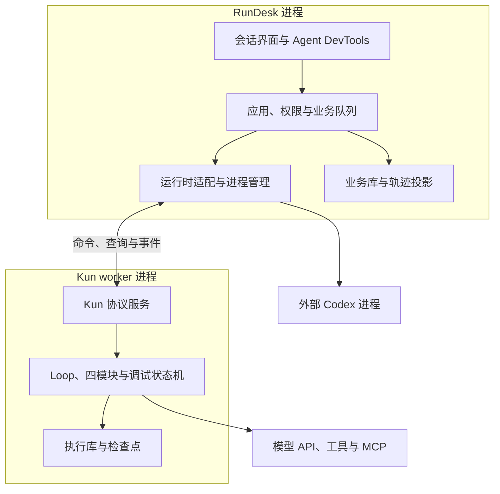

> 实现进度：RunDesk 0.32.0 / Kun 0.8 在 K0–K2 本地核心与 K3-A 离线记录实验上，新增 K3-B 首批安全运行时分叉：固定预览、独立 Hybrid、模型重算、严格工具录制回放和未命中停止。K3-C / Live / 第二种 LoopPolicy / 模块组合及 K4 尚未实现；真实服务与本版真实浏览器验收未完成。逐阶段证据见 [KUN-PROGRESS.md](KUN-PROGRESS.md)，范围见 [KUN-FORKS.md](KUN-FORKS.md)。

# Kun + Agent DevTools：RunDesk 内置 Agent Loop 与调试器设计

RFC：KUN-0001 · 版本：v0.2 · 状态：三项架构决策已确认；实现细节为建议，尚未实现  
修订日期：2026-10-05 · 基线：用户提供的 RunDesk v0.19.4 源码  
源码包 SHA-256：`2c6b9a9dfb8561e6d33958c6f0b1468acace8335242e0d6dc66fd8cf575b0674`

Kun 是随 RunDesk 交付的、可检查、可干预、可组合的 Agent Loop 执行引擎，与 RunDesk 分进程运行，代码保存在同一个仓库。RunDesk 管理应用、会话、权限、业务队列和 DevTools 界面；Kun 持有自己的执行状态、检查点、动作账本与运行控制。DevTools 同时通过 Codex adapter 展示外部运行时可获得的观察证据。这里的“内置”表示产品集成与随包交付。

Agent DevTools 是建立在统一调试协议上的交互工作台：Network、Elements、Console、Sources、Performance、Application、Layers 七个面板共享同一份运行、步骤和状态选择；同时提供供诊断 Agent 调用的结构化调试工具。它与 Kun 一起设计，但不要求所有被观察的执行后端都由 Kun 驱动。

沿用用户草案中的开发者工作台定位。代码包与配置标识用 `kun`，产品名称用 **Kun**。本文定义工程边界与验收条件。v0.2 按用户决策替代此前的同进程方案、独立仓库方案及第三方 Loop 依赖选型建议；本次仅修订设计，尚未复制 PiG 源码或变更运行代码。

## 1. 已确认决策与实施建议

用户于 2026-10-05 确认：① Kun 和 RunDesk 分进程；② 两者代码在同一个仓库；③ 选择性复制 PiG 代码并自主发展，不 fork PiG 项目。以下细分决策中，进程粒度、传输与目录布局是实施建议，尚未经过实现验证。

| 事项 | 决策或建议 | 状态与理由 |
| --- | --- | --- |
| 产品归属 | Kun 随 RunDesk 交付，保留 Go 后端和 HTML/JS 前端 | 已确认方向；由 RunDesk 提供统一产品入口 |
| 进程边界 | RunDesk 与 Kun 使用不同 OS 进程 | 已确认；Loop 执行与产品服务分离 |
| 代码归属 | 一个仓库，初期一个 Go module，两个构建入口 | 同仓已确认；单 module 为初期建议 |
| 源码来源 | 从 PiG 固定版本选择性复制，改造为 Kun 自有代码 | 已确认复制方式；不 fork 整仓、不以 PiG CLI 或库作为运行入口 |
| 执行关系 | Codex adapter 与 Kun 进程 adapter 并列 | 一个 run 只有一个 Loop 执行者 |
| 进程托管 | 首版每个活跃 Kun 会话一个受管 worker，stdio 协议 | 建议；沿用现有会话连接与进程回收模型 |
| 存储权威 | RunDesk 写业务库；Kun 写会话执行库 | 建议；通过事件形成业务投影，不跨进程双写执行状态 |
| 观测事实 | 保存原始证据，按字段注明来源与缺失 | 不从工具日志推断完整提示词或隐藏推理 |
| 快照与恢复 | Snapshot 用于查看，Checkpoint 用于恢复 | 状态视图必须与可继续执行状态区分 |
| 模块替换 | 四模块返回声明式结果，由 Kun 内核统一提交 | 模块不能旁路执行或扩大权限 |
| 编排策略 | 简单工具循环与可替换 LoopPolicy | 首版不为模块化额外增加模型调用 |
| 优化 | 先实现执行、检查与干预，再评估 JIT/JEV | 优化不能先于可靠状态与副作用语义 |
| 兼容 | 缺少 runtime 字段的历史会话仍按 Codex 处理 | 不自动迁移或重跑已有原生线程 |

## 2. v0.19.4 实际已有的基础

以下为方案形成时的源码静态核对记录；当前版本的测试与验收状态以 KUN-VALIDATION.md 为准。

| 源码位置 | 现有实现 | Kun 接入方式 |
| --- | --- | --- |
| `internal/app/manager.go` | `Start/run/StopRun/Approve`、会话状态、`handle.client *rpc.Client`，直接调用 Codex RPC | 保留应用准入与会话协调；把后端调用收进 runtime adapter |
| `internal/app/steer.go` | `expectedTurnId`、`requestId`、提交去重、`turn/steer` | 保留 HTTP 语义；Kun 增加指令入队与实际应用回执 |
| `internal/app/queue.go`、`schedules.go` | 任务队列、并发限制、定时触发 | 继续由 app 调度；Kun 不再创建第二个业务队列或 Cron |
| `internal/app/instances.go`、`applications.go` | Instance 配置身份、应用绑定、配置修订 | 在现有应用设置中加入 RuntimeSpec 和 KunSpec |
| `internal/app/execution.go`、`environments.go` | local/docker 执行环境 | 与 codex/kun 后端选择分开；容器接入需要单独适配 |
| `internal/app/approvals.go` | 原生请求与允许选项校验 | Codex 路径保留；Kun 用中立审批对象接入同一审批 UI |
| `internal/store/store.go`、`batch.go` | SQLite objects/events、WAL；PutMany 仅事务写 objects | RunDesk 库保存业务投影及接收游标；Kun 执行库另实现状态、事件、动作账本联合提交 |
| `internal/store/trace_snapshot.go` | 按来源会话和事件游标导出只读分析数据库 | 继续用于证据隔离，不当作 Loop checkpoint |
| `internal/store/trace.go` | 生命周期事件方法白名单 | 为 Kun 事件补查询与投影，不能只写入新事件名 |
| `internal/tracequery`、`internal/web/trace*.js` | 单一 Turn 时间轴、步骤详情、只读分析工具 | 复用现有阅读结构，增加步骤状态与检查点 |
| `internal/mcptest/client.go` | 有界、一次性 MCP 诊断客户端；不支持 sampling/elicitation 请求 | 提取传输经验，另补运行期连接管理、取消与请求路由 |
| `internal/app/mcp_tests.go` | 工具发现与独立测试；测试调用显式绕过 Agent 审批 | 不能把测试入口直接接为 Kun 的执行入口 |
| `internal/app/application_keys.go` | 外部应用访问 RunDesk 的凭证 | 与模型、Jina、Apify 等上游 API 凭证严格区分 |

旧版架构文档里部分“下一步”内容已经在代码中实现。本设计以当前源码为基线，不将这些能力重新列为 Kun 新功能。

## 3. 双进程、同仓的系统边界



### 3.1 职责和依赖方向

RunDesk 持有业务状态：用户、应用、项目、会话身份、任务入队、Cron、访问控制、配置编辑、密钥解析、产物登记和总预算。RunDesk 启动、监督及回收 Kun worker；浏览器与外部应用继续使用 RunDesk API。

Kun 持有执行语义：上下文、有效资源配置、Loop 阶段、模块状态、工具动作、检查点、控制命令和恢复资格。每个 run 只有一个状态写入者。Kun 根据运行预算执行本地限额，RunDesk 管理应用间配额，不增加第二套业务队列。

同仓只共享协议 DTO、错误码、schema、测试 fixture 与必要的无状态基础代码。Kun core 不导入 app/web/Codex RPC，RunDesk 也不通过 Go 函数直接调用 Kun core。共享结构必须能序列化，不能携带 Go 指针、闭包、数据库连接或宿主服务对象。

Codex adapter 与 Kun adapter 并列。Codex 的运行、停止、原生审批和 steer 继续使用原生接口；Kun 不充当驱动 Codex 的另一层 Loop。完整断点和恢复能力由 Kun 原生状态机提供。

### 3.2 进程粒度与生命周期

初期建议每个活跃 Kun 会话一个 worker，同一会话的后续 turn 可复用进程，空闲后回收；分叉实验使用新会话及 worker。通过排队和进程上限控制容量，不为每个模型或工具调用新建 Kun 进程。数据按会话隔离，并使用唯一 worker 身份、独占所有权与 fencing 校验防止两个 worker 同时推进同一会话。

首版用受管子进程，不承诺 RunDesk 退出后 Kun 继续执行。正常关闭：停止接收新任务、停止派发动作、核对在途调用、提交可恢复状态后退出；超过期限的强制终止可能留下 outcome_unknown。检测控制通道 EOF、父进程退出或租约到期后进入同样的停止流程；必要的 OS 进程组/Job Object 清理由各平台实现。

RunDesk 重启后先做所有权和检查点恢复检查，再按运行策略恢复。分进程使 Kun 崩溃可以独立被检测和处理，但不等于任务不中断，也不自动提供沙箱或主机资源隔离。未来若需要 RunDesk 重启期间任务持续运行，再增加 daemon/service 托管和本地 socket 重连，不在首版含糊承诺。

### 3.3 通信协议

首版建议 stdin/stdout 上的版本化 JSONL：stdout 仅承载协议，日志走 stderr；复用现有进程管理经验，Kun 使用自己的 envelope 与状态语义，不冒充 Codex RPC，也不直接继承 PiG CLI 协议。

- 握手：protocolVersion、engineVersion、build ID、能力表、checkpoint schema 支持范围。相同发布包中的两个二进制仍须校验版本。
- 操作：运行提交、审批响应、控制命令、检查点查询/恢复、分叉与事件补传。命令携带 requestId、目标 session/run、worker epoch 和适用的 expectedStateRevision。
- 去重：RunDesk 先记录待提交请求；Kun 持久保存 requestId、内容指纹与接纳结果。回执丢失后先查询或以同一请求身份重试，不生成第二个 run；同一 ID 携带不同内容必须冲突。worker 更换后的重新投递先核对旧请求状态及新所有权。
- 回执：区分 received、queued、applied、rejected。只有 Kun 提交后的 applied 事件代表执行状态已经改变。
- 事件：按会话单调递增 sequence；先持久化，再发送。RunDesk 以来源会话及 sequence 去重，并在同一业务库事务中更新投影和已应用游标。
- 补传：进程重建后按游标读取持久事件，不自动重复提交原任务；增量文本与持久语义事件分开定义恢复保证。
- 流控：消息有大小限制，内容块按 ID 分页/分块获取；控制读取与数据输出分离。发送队列有界，慢前端不能阻塞取消和状态提交；关键事件依靠落盘与补传保留。

HTTP 请求断开或浏览器关闭不取消后台任务。RunDesk 到 Kun 的控制连接中断则按受管 worker 生命周期处理。两类断开不能混为一谈。

### 3.4 存储与配置边界

建议 RunDesk 保留 `data/state.db`，保存用户、应用、会话元数据、任务、审批、配置及 Kun 事件的查询投影；每个 Kun 会话使用 `data/kun/sessions/<session-id>/state.db` 及独立内容块目录，保存执行状态、检查点、动作账本、控制回执和权威事件。

Kun 执行库只由持有该会话所有权的 worker 写入。RunDesk 展示的运行状态是投影，不得据自身内存中的状态重写 Kun 检查点。一次 Kun 本地事务不能与 RunDesk 业务库事务原子提交：通过 durable event/outbox、序号、幂等接收和启动后核对实现一致性。

离线轨迹由 RunDesk 已同步的事件和快照读取；缺失内容通过 Kun 查询协议获取，必要时以明确的只读 inspect 模式启动 Kun，禁止顺带恢复任务。删除、备份、恢复按统一生命周期协调；未核实 worker 已退出并释放所有权时不删除执行目录。跨会话分叉通过导出/导入检查点内容包及兼容校验完成，不让一个 worker 改写另一会话数据库。

RunDesk 是配置编辑入口，启动 run 时向 Kun 交付有效的模型、Skills、MCP、工具策略及资源版本快照。Kun 负责资源加载、MCP 运行期连接和实际能力解析，并记录实际使用内容。首版不另设可与 RunDesk 静默冲突的 `.pig` 配置来源。

凭证仅通过受限启动通道或约定的凭证交换传递，不放在命令行、普通事件或检查点中。策略变更有版本及应用回执；Kun 在新动作派发前处理已接收的权限撤销，界面不能在回执前声称撤销已生效。存在需要询问的动作时由 Kun 发出审批请求，RunDesk 返回与动作身份绑定的决策。

## 4. 后端、环境与模式分别配置

建议新增：

```json
{
  "runtime": {
    "kind": "kun",
    "hosting": "worker",
    "profileId": "kun-default",
    "profileRevision": 1
  },
  "execution": {"mode": "local"},
  "kun": {
    "mode": "intervene",
    "harnessId": "tool-loop-v1",
    "harnessRevision": 1
  }
}
```

`runtime.kind` 表示执行者；`runtime.hosting` 表示进程托管方式，Kun 首版固定 worker；`execution.mode` 表示执行环境；`kun.mode` 表示调试和优化模式。它们不可混用。初期仅验证本机 Kun worker；工具进入容器与整个 worker 进入容器是不同能力，Docker 尚未适配时明确返回不支持。这里是拟议配置，不是现有 API。

配置入口在应用级，存储复用绑定的 Instance。无应用绑定的通用助手使用自己的默认设置。创建 Session 时固定 runtime 身份，启动 Run 时解析并保存模型、工具、策略、技能和 Harness 的有效版本；运行中的编辑不暗中改变这一版本。

| Kun 模式 | Codex 后端 | Kun 原生后端 |
| --- | --- | --- |
| off | 沿用原行为，不启动 Kun 增强采集 | 保留基础 Loop 与必要执行日志，关闭增强检查和优化 |
| observe | 已有 RPC 事件；可选 Hook/rollout 补充 | 增强状态检查，不开放调试修改 |
| intervene | Codex adapter 不提供内部断点；原生控制继续可用 | 支持已实现并验证的安全点暂停、修改、继续 |
| optimize | 不支持改写其内部执行路径 | 在已验证的守卫与工具授权范围内使用快速路径 |

“关闭 Kun 就恢复旧 RunDesk”适用于未选择 Kun 后端的既有应用；原生任务不能关闭自己的执行内核后继续执行。切换应用默认后端只影响新会话，不把现有 Codex thread 原地变成 Kun 会话。

API 返回有效能力表，例如 `canSteer`、`canPauseAtBoundary`、`canResumeCheckpoint`、`canFork`、`canOptimize`，并附限制原因。能力由模式、adapter 版本、执行环境和当前授权共同决定；不以一个 `supportsKun` 布尔值代替。

## 5. 首个原生 Loop

默认策略采用简单工具循环：

1. 接收经 app 授权的运行输入，固定配置版本、预算与 run ID。
2. 在安全点消费控制命令与补充指令，提交新的状态 revision。
3. Capability 生成本步可用工具与 Skill 集合；Memory 构造模型上下文。
4. LoopPolicy 决定是否需要显式规划；默认不为每一步额外增加一次规划模型调用。
5. 保存 `before_model` 检查点并调用模型，流式显示文本；不执行尚未完整接收和验证的工具参数。
6. 完整保存模型响应与工具调用意图，逐个验证工具身份、参数、权限和预算。
7. 保存 `before_tool` 检查点；根据断点、审批或停止请求等待，批准后再次校验仍有效的执行条件。
8. 通过统一工具执行入口执行，保存结果与副作用状态；结果进入下一次上下文。
9. 如无工具调用且符合结束条件，提交最终回复；否则继续循环。达到预算上限时明确结束原因。

模型调用、工具调用、压缩和检查器等待各有独立的 step 类型。轮次结束表示执行结束；业务成功由应用验收或 evaluator 单独给出。工具未报错、模型说“完成”都不能自动证明业务成功。

首版工具调用串行执行。以后只有显式标注可并行、无依赖冲突的动作才并行；返回上下文时保持稳定的调用顺序。每个 tool call ID 对应一个最终结果；中断、拒绝和未知结果有独立状态，不能伪造成正常成功结果。

最小预算包含：模型调用次数、工具调用次数、估计/实际 token、累计费用（有价格依据时）、运行活动时间、单工具超时、连续失败次数。用户暂停时间单列，不当作模型延迟；队列占位与暂停超时由 app 管理。

## 6. 四模块与调度策略

| 模块 | 输入与输出 | 首版默认实现 | 明确边界 |
| --- | --- | --- | --- |
| Memory | 状态与预算 → ContextBundle、压缩建议、引用来源 | 历史窗口、项目笔记、显式 Skill、工具输出裁剪；超限摘要 | 不删除原始记录，不单独掌握会话真相 |
| Planning | 目标、已有计划、反馈 → PlanDelta / 下一步建议 | 无显式计划或简单计划 | 不要求展示模型隐藏推理；没有结构化计划时明确为空 |
| Action | 工具意图、结果 → 校验结果、执行/恢复建议 | 参数校验、错误分类、有限重试 | 模块输出由内核和宿主授权；不得自己旁路调用工具 |
| Capability | 应用许可、工具目录、Skills → 可暴露能力集合 | MCP + 内置工具；Skill 元数据检索及按需读取 | 只能在已有授权内筛选，Skill 内容不是权限授予 |

`LoopPolicy` 决定模块调用顺序和循环阶段，首版仅实现 `tool-loop-v1`，以后增加 Plan-Act 或 Reflection。否则“四个模块可替换”仍会被固定控制流限制。

模块实现声明 `id/version/stateSchemaVersion`，并提供序列化、恢复与兼容校验。所有输出先变成状态变更，由 Kun 串行提交。模块需要模型或工具时，向内核申请并进入同一事件、预算和授权通道。

替换模块在安全点创建新 Harness revision。存在未处理的模型调用或工具批次时不直接更换消息协议、模型或工具 schema；必须完成、取消或显式作废旧意图。不能通过改模块实现替换来继承原动作的审批。

## 7. 事件、Snapshot 与 Checkpoint

### 7.1 事件是证据，状态是主要阅读入口

保留现有 `events` 表及原始 Codex envelope。新增 `kun/*` 生命周期事件与中立投影，不制造看似来自 Codex 的原生通知。前端轨迹查询、后端 `tracequery` 和只读导出同时扩展。

建议的事件扩展字段：

- `schemaVersion`、`sessionId`、`runId`、`turnId`、`stepId`、`parentStepId`、`attempt`。
- `runtimeKind`（codex/kun）、`engine`（Kun 原生运行为 kun）、`engineVersion`、`captureMethod`（rpc/hook/rollout/provider/native）。复制代码的上游来源记录在构建清单中，不把 Kun 标为正在运行 PiG。
- `module`（memory/planning/action/capability/runtime），允许模块为空或有辅助标签。
- `stateRevision`、`snapshotId`、`checkpointId`、`sourceEventIds`。
- `occurredAt`、`receivedAt`、`sourceSequence`；延迟回填不能只按接收时间假装是现场顺序。

建议事件：`kun/run.started`、`kun/context.built`、`kun/model.started`、`kun/model.completed`、`kun/tool.prepared`、`kun/tool.finished`、`kun/checkpoint.committed`、`kun/control.applied`、`kun/run.finished`。文本 delta 是传输片段，不为每个 token 创建完整快照。

Hook 与 RPC 捕获同一次调用时，优先按原生 thread/turn/item/call ID 归并。缺少可靠标识时保存候选关联及不确定性，不靠时间接近就合并或重复计入工具次数。

### 7.2 Snapshot：可检查的状态视图

| 状态域 | 记录内容 |
| --- | --- |
| 上下文 | 有序消息引用、角色、项目笔记版本、Skill 内容哈希、压缩来源、实际发送的请求视图 |
| 能力 | 本步暴露的工具定义、schema 哈希、服务状态、请求策略与有效策略 |
| 计划 | 结构化目标、计划版本、未完成步骤；无法获取时注明缺失 |
| 执行 | phase、step、attempt、待处理工具调用、预算、用量、停止原因 |
| 环境 | workspace/environment 引用、代码版本、受跟踪产物清单；不冒充文件系统完整快照 |
| 来源 | 字段级证据 ID、采集时间、覆盖范围、脱敏与截断标记 |

每个字段至少区分 `observed`、`reconstructed`、`inferred`、`missing`，另记 `redacted/truncated`。`confidence` 只用于可解释的诊断推断，原始事实不人为分配 0.9 等分数。

Kun 可以精确记录自己在客户端构造并发出的请求，但不能据此声称知道模型服务端内部上下文或隐藏推理。Codex 仅展示实际获得的数据；本地 vLLM 请求日志也需要明确其捕获点与字段覆盖。

状态在不可变消息块、工具定义块和技能块上保存引用，按边界保存 manifest；避免每一步复制完整历史导致存储二次增长。迟到的观察证据生成新的投影 revision，旧分析仍能按原游标与版本复现。

### 7.3 Checkpoint：可继续执行的承诺

Checkpoint 引用一个 Snapshot，并额外保存：

- Kun engine、LoopPolicy 与模块的版本、序列化状态、下一执行阶段。
- 已消费的控制命令游标、待执行工具列表及每个调用的账本状态。
- 模型/工具/Skill/Harness 的版本与内容引用。
- 待处理授权的绑定信息、剩余预算、环境兼容条件。
- `resumeEligibility`（supported/conditional/unsupported）及原因。

首版稳定边界是：模型请求前、完整模型响应提交后且工具执行前、工具最终结果提交后、压缩提交前后。运行中网络连接、流式 token 中间位置和任意 goroutine 栈不承诺可恢复。

内核事件、state revision、动作意图或动作结果、检查点指针通过 Kun 执行库的一个本地事务提交。大内容先持久化成不可变块，再提交引用；事务内不执行网络或工具操作。提交后通过协议发送事件，RunDesk 独立更新业务投影；投影延迟不改变 Kun 的权威状态。Codex 原生路径可继续保留既有写入方式。

这只能保证本地一致性，不能使外部 API 和 SQLite 成为同一个事务。

## 8. 暂停、Steer 与分叉

### 8.1 安全点控制

建议使用每 run 单写入者和控制命令队列。模型/工具 I/O 可在受管理的工作协程运行，状态修改只由主执行者提交。等待 I/O 时仍要接收停止和暂停请求，不能持有阻止控制接口的全程互斥锁。

外部会话状态尽量沿用当前 `running/waiting/stopping/...`；把 `waitReason=approval/debugger/user_input` 及内部 phase 单列，避免所有队列代码都依赖新的顶层状态值。暂停继续占用该 session 的在途资格。

控制操作包含：`pause`、`resume`、`step`、`steer`、`patch_context`、`replace_tool`、`cancel`。每个操作携带 `requestId`、预期 run/turn、`expectedStateRevision`，并记录 `queued/applied/rejected` 与实际应用 step。相同 ID、不同请求内容返回冲突。

| 情况 | 规定行为 |
| --- | --- |
| 模型正在流式输出时暂停 | 返回“正在请求暂停”；在下一个安全点进入 paused，不宣称立刻冻结模型 |
| 工具执行中暂停 | 停止派发后续工具；等待当前调用结束或报告取消结果 |
| 发送 Steer | 入队后显示已接收；安全点应用后显示已生效；不等同于已影响刚发出的模型请求 |
| 单步 | 从暂停点执行一个定义明确的模型/工具/压缩步骤，再停下；不是一个 token |
| 修改待执行工具参数或替换实现 | 作废旧审批，重新校验 schema、权限、预算并生成新动作身份 |
| 状态已变化 | 返回 revision 冲突；不把过期页面的控制应用于新的任务 |
| 取消外部调用但结果不可确认 | 标记 outcome_unknown；不把“本地连接关闭”等同于“远端未执行” |

新指令在模型返回后、工具执行前生效时，必须显式保留或作废原工具意图。作废的 call ID 需要完整的取消结果记录，不能静默丢掉半个消息协议。

### 8.2 回放、继续与分叉是三个功能

| 功能 | 是否执行模型/工具 | 说明 |
| --- | --- | --- |
| 轨迹回放 | 否 | 读取已有状态与事件；Codex 和 Kun 都可用 |
| 检查点继续 | 是 | 仅恢复兼容且允许恢复的 Kun checkpoint |
| 分叉实验 | 可能 | 新建 session/run，关联来源 checkpoint；明确模拟与真实执行模式 |

Fork 默认先生成预览，列出上下文差异、工具版本、环境差异和将发生的外部动作。模拟模式复用已记录的工具结果或测试 fixture，明显标注模拟数据；真实执行模式仍通过当前授权与动作账本。

对 Codex 轨迹可做“提取任务后在 Kun 新运行”的迁移实验，但这不是从 Codex 隐藏状态精确恢复。不要把它标为同一个 checkpoint 的重执行。

恢复历史上下文不能恢复外部世界：数据库、发送过的消息、远端任务不会因分叉而回滚。代码版本、文件快照与隔离工作区可作为后续独立能力，检查点首先说明自己覆盖什么。

## 9. 工具、权限与崩溃恢复

所有动态 Loop、编译路径、模块调用都经过同一个工具执行入口：工具解析 → schema 校验 → 有效授权 → 动作记录 → 执行 → 结果记录。不能通过 JIT 或工具替换跳过其中任一步。

沿用 v0.19.4 的用户交互：默认策略、始终允许、每次询问、禁用。但 Kun 必须自己执行对应规则；写入 Codex 原生 `approval_mode` 不会自动约束 Kun。

定义 Kun 的显式策略映射；旧 `auto/writes` 或其他未知策略没有可靠映射时要求配置解析或返回不支持，不悄悄降为允许。MCP 工具注释只作为信息来源，不能单独成为扩大权限的依据。

“始终允许”在规则仍匹配、授权仍有效时免去重复提示。审批绑定应用、工具身份与 schema、参数指纹、执行环境、策略 revision 和授权范围。改变参数、实现或越出范围必须重新判断。授权撤销在新动作派发前生效。

动作账本记录 `prepared/dispatched/succeeded/failed/cancelled/outcome_unknown`，并包含 invocation ID、attempt、幂等能力和远端回执。崩溃发生在远端完成与本地结果提交之间时，恢复为 outcome_unknown：

- 有远端幂等键或可靠结果查询时，先核对再决定是否继续。
- 明确只读的操作可按应用策略重试，但仍记录额外成本与数据时效变化。
- 不具备幂等保证的写操作不自动重发，进入恢复处理。

HTTP 提交幂等键只解决“任务重复提交”，不能证明工具副作用恰好执行一次。

权限策略也不等于系统沙箱。Kun 首版不自动获得 Codex 的文件系统/网络隔离；本地工具必须声明执行边界。Docker 初期未适配时返回明确不支持，不回退到宿主机执行。执行不可信生成代码的进程隔离与资源限制应由专门 executor 承担。

## 10. 模型与凭证

模型配置使用 ProviderProfile：协议类型、endpoint、model、credentialRef、能力标记和 revision。首版验证一个 OpenAI 兼容工具调用协议；兼容性以实际服务验证为准，不因接口路径相同就承诺所有模型可用。

多模态文件保留内容块与文件引用；服务不支持图像/文件时明确拒绝相关输入或按已配置的转换流程处理，不能静默丢掉附件。模型请求、输出 token、缓存用量和费用分别记录；缺少用量时标记 unknown/estimated。

上游凭证由 RunDesk 解析，按必要作用域通过受限进程通道交付给 Kun Provider 或工具。Kun 状态只保存引用与版本，不保存 API key 明文。启动配置中的 secret 字段与普通可记录协议分开处理；首版可解析明确绑定到应用的服务端环境变量引用，通用加密凭证仓库作为单独工程项。

完整调试请求和工具输出按会话访问权限保护；默认排除认证头、密钥与敏感环境变量。预览脱敏与内部恢复内容引用分开，不能用脱敏后的请求冒充原始精确输入。展示 capture policy、redaction 和 truncation 标记。

## 11. PiG 源码复制与自主发展

已经确定采用“选择性复制源码”方式。RunDesk 仓库不建立 PiG 整仓 fork，不通过 Git submodule 引入它，也不把 PiG CLI 或外部 Go module 作为 Kun Loop 运行入口。迁入代码随 Kun 开发、测试和发布；后续上游改进按具体文件和行为评估后人工移植，不承诺自动 merge 或全面行为对等。

已查阅的候选源码基线为 [MichaelKinsy/PiG commit 827932db70e545b34c3f1d9c04f58a70eacd3b28](https://github.com/MichaelKinsy/PiG/tree/827932db70e545b34c3f1d9c04f58a70eacd3b28)。这是后续逐文件迁移的候选基线，尚未形成最终复制清单，也尚未执行集成验证。

| 范围 | 迁移建议 | Kun 必须掌握的边界 |
| --- | --- | --- |
| 模型与流解析 | 优先检查 ai/provider 相关代码及测试，首批只迁入实际使用的协议 | 请求快照、取消、用量、错误分类和预算 |
| 工具与 MCP | 按所需传输、工具与依赖闭包迁入，补运行期测试 | 审批、工具身份、动作账本、取消与副作用 |
| Skills 与资源解析 | 选择性迁入解析、发现、元数据处理 | 有效配置来自 RunDesk，记录选择/读取/实际注入 |
| 持久化执行 | 重点参考并评估 durable 中状态阶段、工具恢复及分叉代码 | Kun 自有 checkpoint schema、安全点和 outcome_unknown 语义 |
| 扩展机制 | 首版按明确需要迁入小范围协议或资源发现 | 不承诺兼容全部 PiG/Pi 插件与 Node 扩展 |
| 产品层 | 不迁入整套 CLI/TUI、PiG 账号配置及另一套产品入口 | 两个自有命令入口、统一 RunDesk 配置体验 |

这些能力位于 PiG 的不同层。复制 durable 并不自动获得 coding 层的 Skills、MCP 和插件；既有 Hook 也不自动等于 Kun 所需的暂停、步进或精确上下文快照。每一批迁移必须验证依赖闭包、Go 工具链要求及许可证，不能仅凭包名判断可直接抽取。默认构建保持无 Node.js 运行时依赖。

迁移记录随代码提交保存：

1. `docs/UPSTREAM.md`：来源 URL、commit、原路径、新路径、原文件哈希、迁移原因、修改摘要及对应验证。
2. `THIRD_PARTY_NOTICES.md` 与所需 `LICENSES/`：保留实际迁入文件及依赖适用的许可文本、版权与来源声明；文件原有版权头随迁入保留。
3. README 致谢说明 Kun 的部分代码来源于 PiG，以及实际涉及的 Pi 上游来源；不暗示双方为同一作者或官方背书。
4. 将相关原始测试作为可追溯的迁移参考，并补充 Kun 协议、检查点与副作用契约测试。修改上游行为时明确记载 Kun 选择的语义。

本次没有复制任何实现文件，因此上述来源清单和许可文件是实施要求，不是已经完成的仓库资产。进入迁移时只登记真实复制范围，不能对尚未使用的全部 PiG 依赖做错误归属。

## 12. Codex 捕获：已有 RPC 为主，其他路径补充

RunDesk 已拥有 App Server 请求、响应和通知，首版优先复用。Hook 和 rollout watcher 只补缺失证据；不把安装额外采集器作为开始设计的前置条件。

Hook 支持与信任规则要按用户实际安装的 Codex 版本探测。观测 Hook 不阻塞工具等待用户调试；可干预 Hook 如果未来启用，必须单列模式、超时与能力，不能隐藏在 observe 中。

Rollout watcher 需要增量游标、文件轮转与半行处理、去重、会话归属和迟到回填。访问范围限定为应用已授权的线程，不能默认扫描整个用户历史。

额外采集失败时记录覆盖缺口，观察层降级，既有 Codex 运行路径继续按其原有规则工作；这不改变 v0.19.4 已有的核心事件日志失败处理。原生 Kun 的恢复日志落盘失败则停止派发新的副作用动作。

“无需改用户 Agent 代码”是适配已有后端的目标，不是对任意黑盒 Agent 都能获得完整内部状态的保证。

## 13. Agent DevTools 产品、协议与调试工具

### 13.1 七个面板的共同基座

保留当前按 Turn 纵向展开的轨迹页，从“调试”入口展开 DevTools。桌面采用可调整大小的详情区域，移动端采用全屏单面板；不在主对话区同时铺开七块内容。

所有面板共享 `session/run/step/snapshot/stateRevision` 选择。点击 Network 的一次模型调用，Elements 定位到该调用实际使用的上下文，Layers 定位到当时的模块状态，Performance 高亮同一次调用。需要明确区分“跟随现场”和“固定历史快照”；查看历史时，新事件不抢走当前选择。

公共状态栏显示：后端、模式、正在运行/请求暂停/已暂停/等待审批、观察覆盖、当前检查点、预算。只有 adapter 声明可用的操作才可执行；无能力时给出原因。原始 JSON 留在折叠区。

Chrome DevTools 是交互方式的隐喻，不意味着能够直接看到概率模型的真实内部决策过程。这里展示的是决策前可见输入、动作及可验证的状态变化；“为何这样做”的诊断必须附证据并标明推断。

### 13.2 七面板首版合同

| 面板 | 用户要回答的问题 | 主要内容与交互 | 对执行的影响 |
| --- | --- | --- | --- |
| Network | 调了什么、发了什么、返回什么？ | 模型/工具/MCP 列表与耗时；请求、响应、参数、输出、错误、重试、usage；关联快照与原始证据 | 查看无副作用；重新运行只能进入显式重放流程 |
| Elements | 这一步模型实际看到了什么？ | 有序上下文树：system/developer/user/tool、记忆、Skill、工具定义；token 分布、截断/压缩、前后差异与来源 | 编辑生成上下文补丁；在安全点或新分支应用，原记录不改写 |
| Console | 现在能查什么、怎样干预？ | 结构化只读查询、自然语言诊断、控制提案、操作回执；错误可跳转到对应步骤 | 查询与修改分离；修改调用同一控制协议 |
| Sources | 在哪停住、下一步是什么？ | LoopPolicy 阶段、模块版本、工具定义与相关 Skill；断点、单步、继续、检查点 | 原生 Kun 按安全点阻塞；外部后端按能力限制 |
| Performance | 时间与费用花在哪里？ | 模型/工具瀑布、等待与活动时间、重试、token/缓存、压缩、用量与费用归因 | 基础性能展示首版提供，不依赖 JIT |
| Application | 当前持久状态是什么？ | 会话/项目记忆、压缩/淘汰谱系、Skill 版本、MCP 连接、产物和检查点；凭证只显示引用与状态 | 持久修改沿用应用权限，明确生效范围和 revision |
| Layers | 哪个模块出现异常？ | Memory/Planning/Action/Capability 的输入输出、状态、调用关系、规则信号和对比 | 首版检查，后续模块替换形成新的 Harness revision |

Network 展示语义调用，不承诺抓取任意工具内部所有 HTTP 请求。一次 MCP 工具调用就是一个工具 span；其下游网络只有提供额外证据时才展开。工具结果完整内容与有限预览分离，实际未捕获/已截断的数据不得用“查看完整”误导。

Elements 区分“被发现的 Skill”“被选中的 Skill”“已读取的 Skill”“实际注入模型的 Skill”，不把存在于目录中等同于生效。Codex 原始数据不足时显示字段缺口；Kun 的精确范围是自身构造并发送的客户端请求。

Sources 首版是 Loop 阶段调试，不是 Go 任意源码行断点。Memory、Planning 等自定义代码内部若没有显式安全点，只能停在模块边界；未来外接 Delve 等代码调试能力另立设计。

Application 的“当前存储”与 Elements 的“当时输入”必须分开。修改项目记忆不会改变历史快照；记忆已经存入持久层，也不证明某次模型请求实际注入了它。

Layers 首版给出带证据的规则信号，例如同工具同参数重复失败、计划在新目标下没有更新、上下文预算溢出、工具发现失败。信号包含 rule ID、规则版本、事实、解释和误报反馈；不能仅凭相关性宣称 Planning 必然导致 Action 的错误。

### 13.3 断点与单步

断点是有版本的声明式规则，作用范围为 session/run；本轮应用时固定版本，临时修改须有回执。首批支持：

- 模型调用前/后、工具执行前/后、压缩前/后。
- 指定工具 ID、模型或模块；指定错误类别。
- 同一工具及参数指纹连续失败达到阈值。
- 上下文使用量、累计费用或剩余预算达到阈值。
- 自定义结构化信号满足类型化条件。

条件使用受限的字段、比较与逻辑运算，不在调试服务器执行任意 JS、Go 或 shell。断点调试与工具审批是两个独立等待条件：点击继续只解除断点，不能顺带批准工具。

`onLowConfidence` 只有在某个明确的决策模块提供可解释、经过校准或明确标为启发式的信号时才可用。不能把模型文字中的“我有 90% 信心”当作系统概率。JEV 不存在时，其余断点照常运行。

“错误时暂停”适合作为开发模式的可选预设，默认不应用于 Cron/无人值守任务，避免后台任务无限占位。设定暂停超时与人工处理策略，超时停止或保持等待由应用明确配置，不擅自继续有风险的动作。

单步的单位是一个模型、工具或压缩步骤。未来若支持工具并行，设置断点后需描述哪些调用已在飞行；暂停完成条件为不再派发新动作且在飞行结果已被核对，不能声称冻结已发往远端的操作。

### 13.4 Console 与 Agent Debug Tools

调试能力提供统一的 DebugService，HTTP/UI 和只读 MCP 工具调用同一实现。已有 `internal/tracequery` 与来源快照限制可以逐步扩展，不另建一套拥有全库权限的调试服务器。

| 工具组 | 拟议工具 | 返回/行为 |
| --- | --- | --- |
| 运行与能力 | `debug_get_run`、`debug_get_capabilities` | 当前状态、有效能力、版本、可用安全点 |
| 调用证据 | `debug_list_calls`、`debug_get_call` | 有界查询、原始证据引用、请求/响应及分页 |
| 状态 | `debug_get_snapshot`、`debug_get_context`、`debug_diff_snapshots` | 固定版本状态、真实上下文、变更来源 |
| 分析 | `debug_get_performance`、`debug_get_layers` | 时间/费用与模块状态、规则诊断 |
| 检查点 | `debug_list_checkpoints`、`debug_get_checkpoint` | 恢复资格、依赖版本、未知副作用 |
| 修改提案 | `debug_propose_patch`、`debug_preview_fork` | 无副作用的差异、目标、预期执行清单与提案 ID |
| 运行控制 | `debug_control` | 暂停/继续/单步/停止/steer 的受权命令与回执 |
| 应用与分叉 | `debug_apply_patch`、`debug_create_fork` | 校验提案及当前 revision 后修改未来执行或创建新运行 |

这些是拟议工具名，不表示本次已安装。实际首版可只暴露前五组及提案；可变更工具按 app 授权和运行模式独立开放。

普通诊断 Agent 默认获得固定来源范围的只读工具；自然语言 Console 使用独立诊断会话，成本单列。它查询目标 run，不把解释问题写入目标 Agent 的上下文，也不让目标 Agent 因等待自己提供调试服务而死锁。

自然语言指令如“换一个搜索结果试试”，先解析成类型化提案并展示目标、差异和执行模式；在已有授权足够时可应用，否则按当前权限规则处理。结构化查询/控制不依赖 LLM；JEV 是未来可选决策优化，不能充当控制台权限判断器。

工具授权细分为 `debug.read`、`debug.control`、`debug.patch`、`debug.fork`、`debug.optimize`。每次访问校验 app/project/session 归属；read 权限不推出文件写入、system prompt 编辑或真实重执行权限。

控制与修改都带 request ID、目标 run/turn、expected revision、操作者及原因；修改成功返回旧/新 revision、应用 step、checkpoint 和审计事件。历史快照不可原地编辑；工具输出替换标为 synthetic，保留原返回，并禁止冒充原服务响应。

### 13.5 时间旅行的三种模式

| 模式 | 具体语义 | 新的模型/工具调用 | 边界 |
| --- | --- | --- | --- |
| Deterministic / 记录编辑回放 | 查看原记录；补丁形成新分支，依赖被改结果的下游标为 stale | 无 | 不是重算概率模型，更不代表新路径已经验证成功 |
| Live / 真实重执行 | 从可恢复 checkpoint 创建新分支，重新执行之后的模型与工具 | 有 | 重新授权，可能产生费用与外部副作用；不能承诺输出相同 |
| Hybrid / 模型重算与工具录制回放 | 重新调用模型，工具结果由录制数据或显式 fixture 提供 | 模型有，工具不真实执行 | 命中严格匹配才复用；未命中停下并报告，不自动转为 Live |

Hybrid 的匹配键至少包含工具身份/实现版本、schema 哈希、规范化参数指纹、相关环境与 fixture 版本。同一名称、不同 URL 或不同查询条件不能复用同一个结果；重复调用还需要调用位置或调用序列规则消除歧义。

如果新路径要求未录制的动作，返回 `replay_miss`，由操作者补充 fixture 或显式创建 Live 分支。纯录制回放无需新增模型/工具调用；不要用“免费”掩盖存储、计算或原有调用成本。

每条分支记录来源 checkpoint、patch、模式、真实/模拟 span、工具副作用策略和预算。diff 同时比较上下文、计划、调用、结果、产物、费用与业务验收；含 stale 或模拟数据的分支不能标成通过真实集成验证。

### 13.6 本地优先与框架无关

调试数据默认保存于当前 RunDesk 部署的业务库、Kun 会话执行库和文件目录，不要求接入外部 tracing SaaS，不默认上传第三方遥测。这里的“本地”是 RunDesk 所在机器；如果部署在云端，就不是操作者桌面。

历史浏览、结构化查询、记录回放与状态 diff 可离线运行。调用远程模型/工具、自然语言诊断则按其 endpoint 联网；不能把“调试记录本地存储”宣传为整个 Agent 数据从不离开机器。

定义框架中立 DebugEvent、Snapshot、Checkpoint 和 CapabilityReport。原生 Kun 直接产生数据，Codex adapter 输出已有证据，未来可增加 JSONL/OTel 导入。导入 OTel 或一份日志不自动获得暂停、恢复或精确上下文能力。

所谓透明捕获，是对已集成的 RunDesk 后端无需用户改业务逻辑。其他语言/框架可能需要 SDK wrapper、装饰器或导入适配；声明适配成本，不对所有 Agent 承诺零改动接入。

### 13.7 Performance 的核算规则

性能面板从 K1 提供基础版本，与编译优化解耦。时间分别统计排队、模型首 token/完整响应、工具执行、审批等待、调试暂停、压缩和本地调度；并行任务区间重叠时，总耗时不能简单相加。

费用保留 Provider 的实际 usage、缺失标记、缓存读写分类、价格表来源与版本；模型自报 token、SDK 估计和服务端实际结算分别标记。工具费用未知时显示未知，不当作零；不能把录制结果所节省的工具费用当成实测账单。

现有 v0.19.4 usage 汇总与 Kun 明细需按调用 ID 去重。是否启用 JIT/JEV 是可比较的运行配置，面板本身不是优化器；同一套指标服务优化前后的评估。

### 13.8 HTTP 与事件协议

拟议资源，保持现有 API 版本化与 SSE 通道：

- `GET /api/v1/sessions/{sid}/runtime-capabilities`
- `GET /api/v1/sessions/{sid}/runs/{rid}/calls?after=...`
- `GET /api/v1/sessions/{sid}/runs/{rid}/snapshots?after=...`
- `GET /api/v1/sessions/{sid}/runs/{rid}/checkpoints/{cid}`
- `GET /api/v1/sessions/{sid}/runs/{rid}/performance`
- `PUT /api/v1/sessions/{sid}/runs/{rid}/breakpoints`
- `POST /api/v1/sessions/{sid}/runs/{rid}/controls`
- `POST /api/v1/sessions/{sid}/runs/{rid}/patch-previews`
- `POST /api/v1/sessions/{sid}/runs/{rid}/patches`
- `POST /api/v1/sessions/{sid}/runs/{rid}/fork-previews`
- `POST /api/v1/sessions/{sid}/runs/{rid}/forks`

示例控制请求（拟议契约）：

```json
{
  "requestId": "debug-command-0001",
  "expectedTurnId": "turn-001",
  "expectedStateRevision": 42,
  "operation": "pause",
  "boundary": "before_tool",
  "reason": "inspect search arguments"
}
```

HTTP 接收成功只表示命令已入队，响应带 command ID 和 queued 状态。SSE 的 `kun/control.applied` 才说明在哪个安全点生效；客户端断线后可查询命令最终状态，不需要重新提交。

补丁请求额外固定 base snapshot、补丁字段、scope（本 run/新分支/应用配置）及预览版本；基础版本改变时重新预览。审批、断点、补充用户输入各有独立 ID 和等待原因，不能共用一个含糊的“继续”回调。

现有开始、停止、steer、审批入口继续保留，路由至所选 adapter。所有端点和工具采用同一 DebugService 授权、审计、分页与内容大小限制；知道 checkpoint/blob ID 不等于有跨应用读取权限。

## 14. 同仓目录与迁移顺序

初期建议一个 Go module、两个构建入口，同一个发布包交付 rundesk 与 kun 可执行文件。Kun 的独立进程不要求现在建立第二个仓库或独立 module。以下目录除当前 RunDesk 已有部分外均为拟议，尚未添加实现：

| 目录/文件 | 职责 |
| --- | --- |
| `cmd/rundesk/` | 现有产品服务入口，管理 API、界面及子进程 |
| `cmd/kun/` | Kun worker 与只读 inspect 入口 |
| `internal/agentruntime/` | RunDesk 侧中立执行接口与能力描述 |
| `internal/kunproto/` | 两个进程共享的序列化协议、错误码和版本 |
| `internal/adapters/codex/` | Codex RPC 与事件翻译 |
| `internal/adapters/kun/` | Kun 启停、握手、控制、事件接收、补传与业务投影 |
| `internal/kun/` | 自主维护的执行内核、状态机、LoopPolicy 与四模块 |
| `internal/kun/provider/`、`tools/`、`mcp/`、`skills/` | 按依赖闭包迁入和改造的所需能力 |
| `internal/kun/store/` | Kun 执行库事务、检查点、动作账本和内容块 |
| `internal/kun/server/` | worker 协议服务；输入控制与事件输出分离 |
| `internal/debugservice/`、`internal/debugtools/` | RunDesk 跨后端查询和调试工具；原生控制转发至 Kun |
| `internal/app/kun.go` | 配置解析、授权、运行准入、配置快照和状态协调 |
| `internal/store/kun_projection.go` | RunDesk 库中的事件去重、投影和接收游标 |
| `internal/web/devtools/` | 七面板及共同选择状态，保持 HTML/JS 结构 |
| `docs/UPSTREAM.md`、`THIRD_PARTY_NOTICES.md`、`LICENSES/` | 逐文件来源、许可和迁移记录 |

AgentRuntime 负责 Start、事件流、Control、能力说明和资源关闭；检查点能力另设可选契约，不要求 Codex 实现。共享 kunproto 不能引用 PiG 内部消息类型或 RunDesk 的 rpc.Message。

迁移顺序：先抽出 Codex 最小适配边界；建立两个命令的构建、协议握手及假 worker；实现 Kun 执行状态和存储；逐批复制经过许可与依赖检查的 PiG 代码；最后接原生运行和 DevTools。复制后代码路径属于 Kun，不增加名义上的 PiG driver 再把控制权交回另一个黑盒 Loop。

特别检查 handle.client、Approval.Request、Steer、原生历史导入、trace analysis、配置连接、空闲回收和进程名额。Kun 专属的 Provider/MCP/Skill 配置不能为了读取配置而隐式启动 Codex。

现有业务并发限制继续复用，分别统计 Codex 进程、Kun worker、活跃 run、工具子进程和模型连接。暂停仍占会话资格；达到 worker 上限时排队，不允许用新后端绕过容量限制。

RunDesk 业务库和 Kun 执行库分别做追加式迁移，旧会话 runtime 缺省仍为 Codex。备份清单记录两个二进制、协议和数据库 schema 版本，并协调执行库、业务投影及内容块；单独复制业务库不能称为完整 Kun 备份。降级兼容须明确校验。

## 15. 分阶段验收

里程碑编号为 Kun 设计阶段，不预占 RunDesk 下一个发布版本。

| 阶段 | 交付 | 验收 |
| --- | --- | --- |
| K0：进程与源码边界 | Codex adapter、双命令构建、Kun 协议、假 worker、PiG 逐文件迁移清单 | 原有开始/停止/steer/审批/队列回归；握手不兼容明确失败；重复消息、异常退出与慢消费者有界处理 |
| K1：最小原生运行与检查 | 选择性迁入 Provider/工具；Kun worker、执行库、简单循环、预算和动作账本；Network/Elements/基础 Performance | 不启动 Codex 完成模型→工具→回复；Kun 独立 PID；提交后的事件可补传；两个数据库职责明确；实际上下文可定位 |
| K2：基本干预与恢复 | Sources/Console、断点、单步/steer、检查点继续、控制幂等；worker 所有权、退出及恢复 | 暂停时可停止；过期控制被拒；杀死 worker 或 RunDesk 后按策略恢复；旧 worker 不能继续推进；未知写操作不自动重跑 |
| K3：组合与分叉实验 | Layers、四模块版本化、第二种 LoopPolicy、Harness 对比；Deterministic/Live/Hybrid；Application 谱系与配置修改 | 更换模块后差异可追溯；Hybrid 未命中必须停止；stale/模拟/真实结果分明；本地历史调试可离线 |
| K4：优化实验 | Skill 候选、快速路径 IR、守卫、去优化、可选决策模型 | 独立验证集达标才启用；偏离条件正确回退且不重放已完成副作用 |

K1 内置最小固定四模块，不等待抽象完美才开始原生闭环。K2 的控制入口从 K1 架构中预留，避免后来改造主循环；完整可配置模块和分叉实验可以后置。

测试分为两种：使用可编排 fake Provider/MCP 的确定性契约测试；使用用户实际模型和工具的集成验收。前者通过不能冒充后者通过。

第一条业务验收建议选 news2douyin 的材料准备子任务：查询一个选定新闻事件、获取相关网页、形成带来源的事件时间线与稿件材料并保存。验证“搜索已配置始终允许时不重复提示”“运行中补充筛选条件”“工具失败后可检查并继续”。视频渲染与发布不作为第一条 Loop 的依赖。

DevTools 专项验收还包括：点击一个调用后七面板采用同一 snapshot；浏览历史不随新事件跳转；手动暂停与审批互不代答；诊断会话不污染目标会话；补丁保留原记录；低置信度信号无来源时不可设置该断点；无 Provider usage 时费用不显示为已知零；关闭增强调试不插入额外模型调用，也不保留活动断点。

## 16. 优化层的研究边界

Loop JIT 首先编译的是经过验证的控制流程与参数化数据处理，不把一条成功轨迹里的输出常量直接当作所有输入的答案。首个快速路径采用受限 IR：工具调用、字段提取、schema 校验、条件分支与终止；解释执行即可，不必先生成并运行任意 Go/Python 代码。

守卫覆盖输入 schema、适用任务域、工具与 Skill 版本、权限、环境前提和中间结果断言。每个快速动作仍写入动作账本；中途守卫失败时，动态 Loop 继承已经完成的结果和执行位置，不能从头重放产生重复副作用。

“零 token”只可能适用于完全不调用模型的那段控制或处理逻辑；联网工具自身可能产生费用、延迟或模型调用。必须同时报告端到端成功率、费用和总时延。

JEV 暂作为可替换 `DecisionPolicy` 候选。分别评估“是否需要调用工具”“选哪个工具”“何时停止”，使用可校准的置信度与弃权回退机制。不能让该模型批准权限或预测一个没有证据的任务成功。

轨迹蒸馏先生成带来源、适用条件、失败案例与验证记录的 Skill 草案；通过评估后才晋升到指定应用的 Capability。初期不自动写入全局 Skill，也不把失败轨迹中的注入指令提炼成规则。

JIT-Agent 的 Harness 生成、轨迹快速路径编译和运行时概率决策是不同机制，可以在 Kun 中协作，但不能用同一个“JIT”指标混合宣传。

## 17. 本次核实的参考与尚待验证项

早期网页查阅日期为 2026-10-04；v0.2 根据已读取的 PiG 固定 commit 源码和用户于 2026-10-05 确认的三项决策修订。以下参考不构成性能实测或全面兼容承诺。

- [PiG 固定源码基线](https://github.com/MichaelKinsy/PiG/tree/827932db70e545b34c3f1d9c04f58a70eacd3b28)：选择性复制的候选基线；查阅了模型/工具、资源、MCP、持久化执行及 LICENSE/NOTICE，逐文件迁移与契约验证仍待实施。
- [sonnes/pi-go](https://github.com/sonnes/pi-go)：保留为历史比较参考，不再作为 Kun 的首选运行库。
- [guanshan/pi-go](https://github.com/guanshan/pi-go)：用于核对模块结构及 alpha/兼容性边界。
- [JIT-Agent](https://github.com/bingreeky/JIT)：其公开 README 使用 Memory、Planning、Action、Capability 四模块组织 Harness；Kun 借鉴分解方法，协议与控制权仍自行定义。
- [OpenAI 插件文档](https://developers.openai.com/plugins/build/plugins)：支持插件携带生命周期 Hook，并说明 Hook 信任要求；不能据此推断任意已安装 Codex 的全部 Hook 均可用。

用户材料中的 AgentJIT、JEV、SPARK、Trace2Skill、SkillTTA 及各项性能数字，本轮未逐项独立核实，不用作首版收益承诺。正式进入 K4 再对候选论文、实现、许可、评测设置和适配成本做专项核实。

新增 DevTools 材料中的 AgentLens、AgentTracer、RunLens、AgentXray、AgentSea、Meterbility、GraphMind、AgentixLens、Rewind 等按用户提供的交互参考理解。本轮未逐项核验项目身份、接口或功能，不将这些描述作为已证实的竞品能力，也不直接引入其代码。普通 tracing 平台同样可能提供实时状态或调试功能；Kun 的定位用自身能力与边界描述，不以未经核实的排他比较为依据。

已经冻结的是：分进程、同仓、选择性复制 PiG 源码并自主维护。首版 worker 粒度、协议字段、最终迁入文件清单、首个实际 Provider 和内置工具清单，在 K0 中具体化并验证。本文后续讨论不再重新打开已确认的三项决策，除非用户明确调整。
