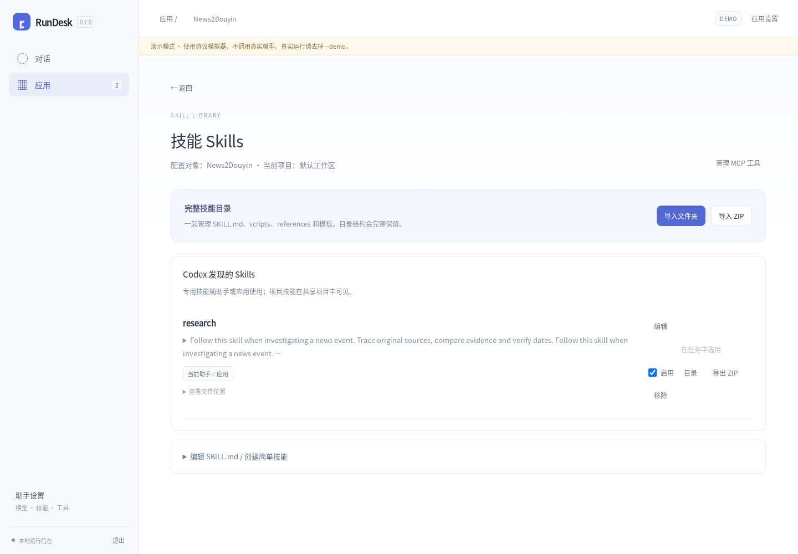
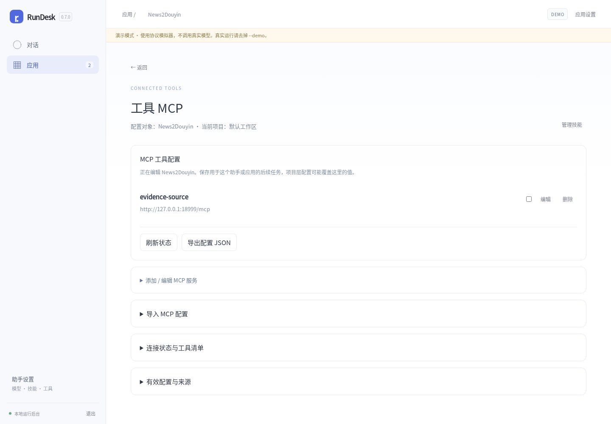

# RunDesk 0.7.0

本版将日常使用收敛为「对话」和「应用」两个入口，并将 Skills、MCP 从拥挤的设置弹窗中独立出来。执行内核继续使用 Codex App Server，应用仍通过原有 API 发起任务。

## 使用入口

- **通用助手**：打开后直接对话；「助手设置」管理模型、认证等配置。
- **应用**：一个应用绑定一份专用配置。查看任务、设置模型、管理技能与工具，都从对应应用进入。新增应用只创建配置登记，不安装业务软件、不自动运行任务。
- **技能 Skills**：独立页面，顶部标明当前助手或应用及项目；以技能列表为主，编辑表单默认折叠。
- **工具 MCP**：独立页面，以现有服务为主；新增、导入和原始配置按需展开。

Skills 与 MCP 页面可相互切换，刷新后保留配置对象，返回后继续原来的对话或应用。桌面和手机布局均经过浏览器验证。

## 完整技能目录

支持「导入文件夹」和「导入 ZIP」。一次导入一个技能，根部包含 `SKILL.md`；ZIP 可以有一层包裹目录。`scripts/`、`references/`、模板和二进制资源文件一起保存。

- 目录浏览支持文本预览，二进制文件展示元信息；可将整个技能导出为 ZIP。
- 编辑 `SKILL.md` 保留其他文件。同名完整替换需要明确勾选，替换与移除前备份原目录。
- 专用技能存放于当前配置的 `CODEX_HOME/skills/`；项目技能存放于工作区 `.agents/skills/`，由使用该项目的助手共享。
- 最多 1000 个普通文件、解压后 32 MiB。拒绝链接、越界路径和重名冲突；空目录不单独保留。
- ZIP 保留脚本可执行位；浏览器文件夹上传无法读取原始文件权限，依据 shebang 设置脚本执行位。导入本身不执行脚本。

备份位置为技能所在配置或项目中的 `.rundesk/skill-backups/`。备份包含完整旧目录。

## 应用与兼容性

界面不要求普通用户理解 instance；底层仍保留 instance 身份。一个专用应用绑定一个专用 instance，默认配置用于通用助手。接入编号收在应用的「接入信息」中。

旧应用任务根据 `source.appId` 和专用配置的明确对应关系自动归类。无任务、默认共享配置或归属冲突的历史记录不会被猜测迁移；可在「接入说明与历史配置」中查看。会话、原生线程、模型、项目笔记及已有技能文件保留。

新增应用登记与技能目录 API，继续提供 `/api` 和 `/api/v1`。OpenAPI 文档版本为 1.2.0。既有 news2douyin 0.11.1 和 rundesk-video-app 0.5.1 已通过协议兼容验证，无需为本次界面调整修改客户端代码。

同时修复切换会话加载期间输入被覆盖的竞态，以及已发送内容再次出现在新对话草稿中的问题。现有消息复制、评价、分享、朗读及工具折叠行为保留。轨迹整体重设计留待后续讨论。

## 升级

1. 停止旧 RunDesk，备份原 `--data` 目录及所使用的 `CODEX_HOME`。
2. 替换二进制，保持原启动参数、服务用户、数据路径及 `CODEX_HOME` 不变。
3. 启动后刷新浏览器；检查通用助手与应用的归属。不要同时启动两个服务打开同一数据目录。

包内包含源码、Linux x86-64 和 Windows x86-64 二进制。Windows 版本仅交叉编译，未做实机测试。升级与界面验证使用协议模拟器；本轮未调用真实模型、搜索、外部 MCP 或视频渲染。详见 [验证记录](VALIDATION-0.7.0.md) 和 [升级指南](UPGRADING.md)。
