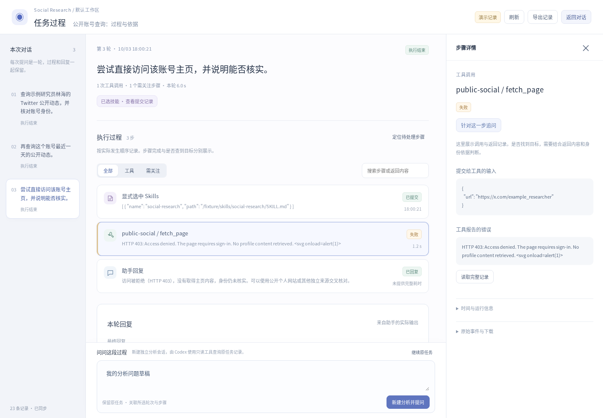
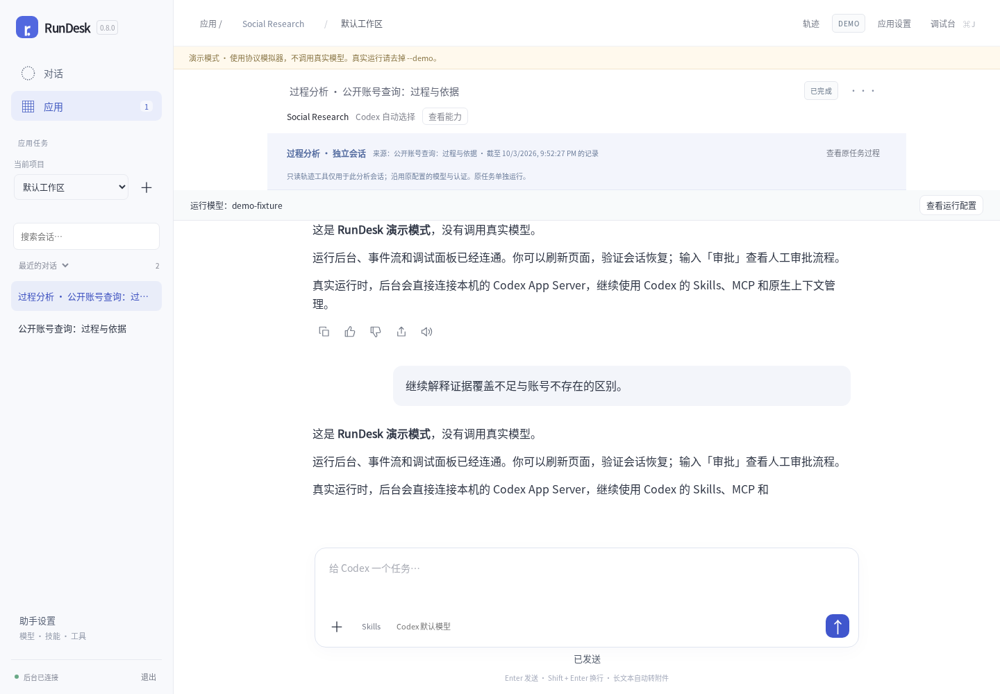

# RunDesk 0.8.0

本版重新设计轨迹，支持围绕真实执行过程发起独立分析。

- 按每轮问题展示实际步骤、回复和工具返回的链接；步骤输入、输出、错误及原始事件可追溯。
- 清楚区分工具完成、空结果、调用失败和中断；不自动猜测查询目标存在与否。
- “新建分析并提问”创建独立会话；原任务保持原来的消息与运行。分析会话中的后续问题继续该会话。
- 内置 5 个只读 MCP 工具，由 Codex 查询轮次、步骤、完整事件和统计。无新增 Node、Python 或外部数据库运行依赖。
- 保存原任务关联和固定快照范围；可在原过程与分析会话间跳转，支持桌面、手机和长记录分页。

分析沿用来源模型和认证；新增工具按会话配置，原应用的长期 MCP 配置不变。只读查询范围是来源会话截至创建时的记录，并默认聚焦选中的轮次。Text2SQL 暂未引入。

已通过真实 Codex 0.159.2 的 MCP 发现与调用测试，以及 Go race、过程页与现有产品界面测试。浏览器中的 Twitter 数据为虚构测试样例；未验证真实 Twitter 查询或模型分析质量。Windows 仅交叉编译。

保留原数据目录和 CODEX_HOME，停服务后替换程序并刷新浏览器即可。详见 [升级说明](UPGRADING.md)、[使用说明](TRACE.md) 和 [验证记录](VALIDATION-0.8.0.md)。
