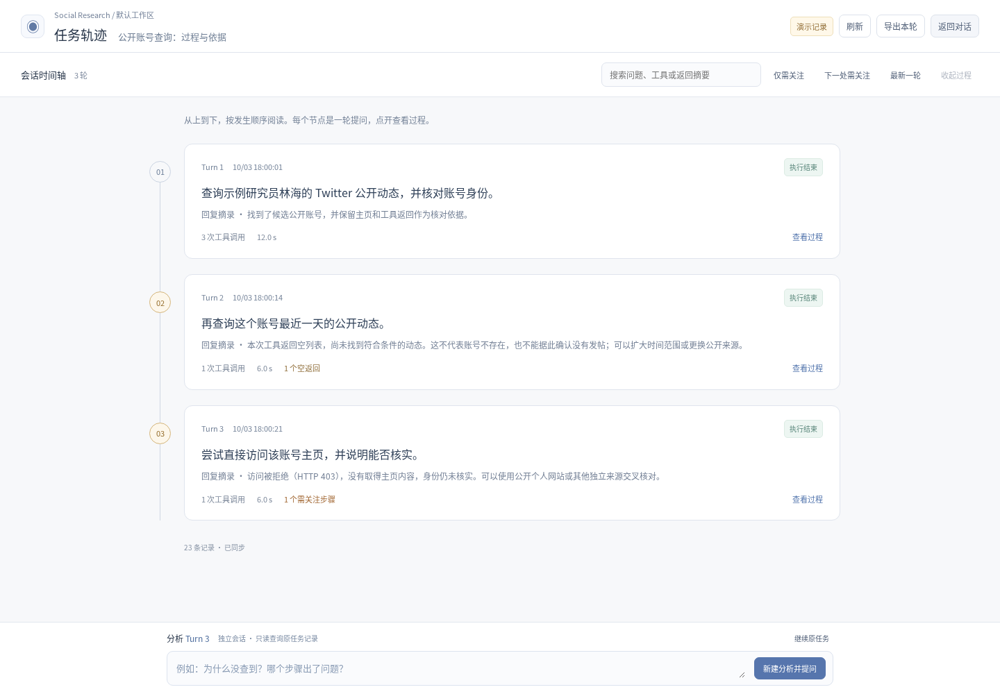
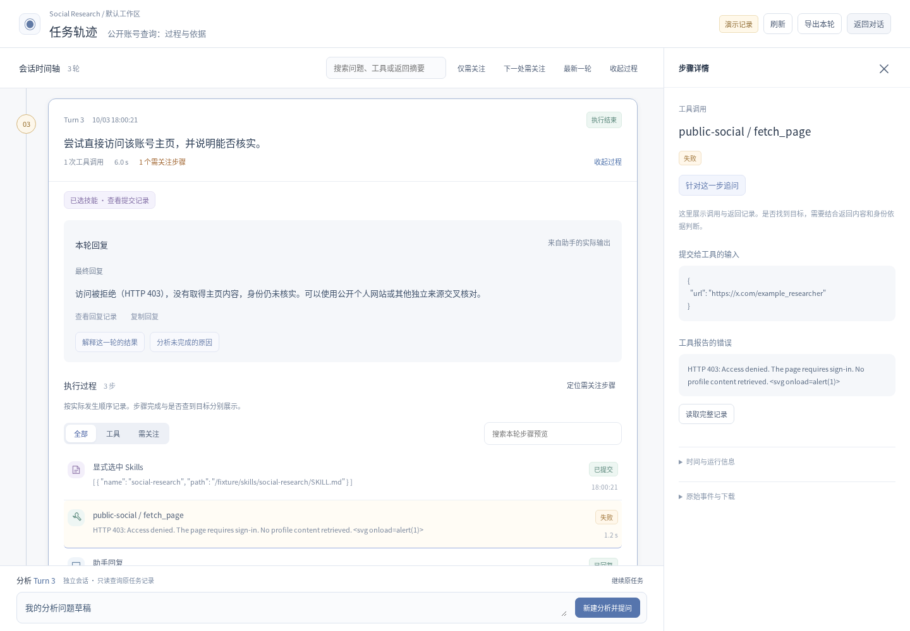

# RunDesk 0.8.1

本版针对“看起来好看、定位问题不好用”的反馈，把轨迹改为一条从上到下的 Turn 时间轴。

- 每个 Turn 是一个主节点，显示问题、实际回复摘录、工具次数、耗时、空返回和需关注项。
- 点击节点原地展开，先看回复，再看执行步骤；点击步骤查看参数、返回和错误。
- 跨轮搜索、仅需关注、下一处需关注和最新一轮帮助定位。新事件不会自动切走历史选择。
- 保留独立轨迹分析 session 和五个只读 MCP 工具。原业务任务不会因浏览或分析而重跑。

设计参考了 LangSmith 的按顺序阅读与逐层查看细节、Langfuse 的多轮会话回顾思路，未引入这些产品的服务或代码。具体来源和取舍见 [设计说明](TRACE-DESIGN.md)。

[使用说明](TRACE.md) · [升级说明](UPGRADING.md) · [验证记录](VALIDATION-0.8.1.md)

截图为虚构测试样例，没有访问 Twitter，也不代表真实模型的分析质量。Windows 仅交叉编译。
