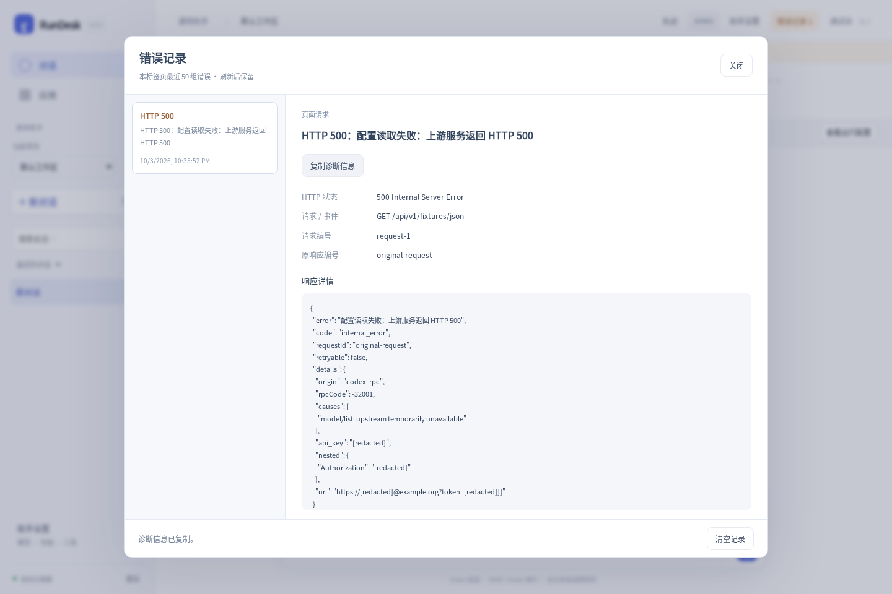

# RunDesk 0.8.2

针对“运行时报 HTTP 500，但页面看不到详细情况”，本版增加错误记录与可复制的诊断面板。

- 从错误提示、顶栏「错误记录」、运行失败卡片打开详情；设置窗口和轨迹页也可使用。
- 查看实际状态、失败接口、请求编号、响应内容、错误代码和关联会话。
- HTML 错误页、空响应、JSON 格式错误、网络中断分别展示；Codex 运行错误单独标记。
- 最近 50 组记录刷新后保留，可复制和清空；后台日志能通过 requestId 对应。
- 保持单轴时间轴、独立分析、技能导入、幂等提交和 SSE 行为。

没有复现用户部署中的那一次 500；本版提供下一次出错时定位的依据。无新增运行依赖。包含源码、Linux amd64 及 Windows amd64 程序，Windows 仅交叉编译。

[使用说明](DIAGNOSTICS.md) · [验证记录](VALIDATION-0.8.2.md) · [升级说明](UPGRADING.md)
