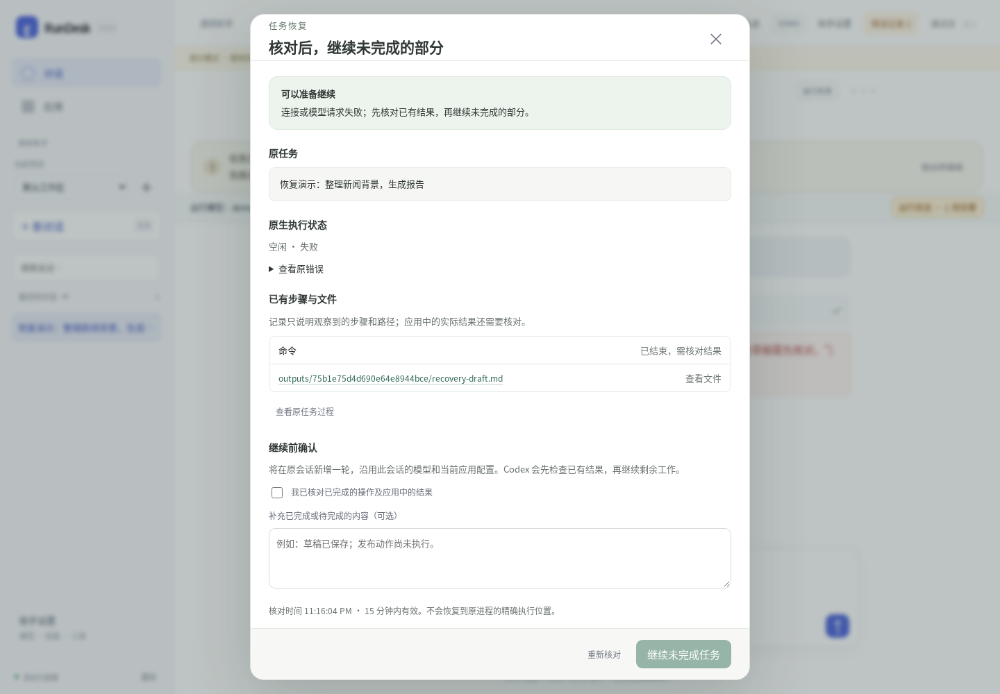

# RunDesk 0.8.4

本版增加失败任务的「核对并继续」，帮助用户和应用在看清已有结果后，继续同一会话中未完成的工作。

- Codex 原生重试状态单独显示，重试中不重复启动任务。
- 恢复窗口展示原任务、错误、原生状态、步骤和可预览的已有文件；补充说明不覆盖主输入框草稿。
- 核对时和提交前两次读取原生状态；仍在运行、已经完成、来源不匹配或结果无法确认时阻止重复执行。
- 继续创建新轮次并记录来源关联；原失败轮次和事件完整保留。任务初始化前失败也能保留原目标后重试。
- 接口增加 recovery/check 与 recover，v1 recover 强制幂等 Key。响应丢失后重试相同请求返回原接收回执。
- 迟到的上一轮事件不覆盖新启动轮次；重试提示随进展和结束清除。

执行仍由 Codex 负责。本版不包含无人值守自动恢复调度器，也不能保证外部写入没有重复副作用；应用必须核对业务结果。详见 [恢复说明](RECOVERY.md) 和 [验证记录](VALIDATION-0.8.4.md)。

停止旧服务，替换程序，沿用原数据目录、CODEX_HOME 和启动参数，刷新浏览器。无需数据库迁移。已有应用客户端保持兼容；想展示恢复流程时可使用新 API。提供 Linux amd64 和 Windows amd64 程序；Windows 仅交叉编译。

