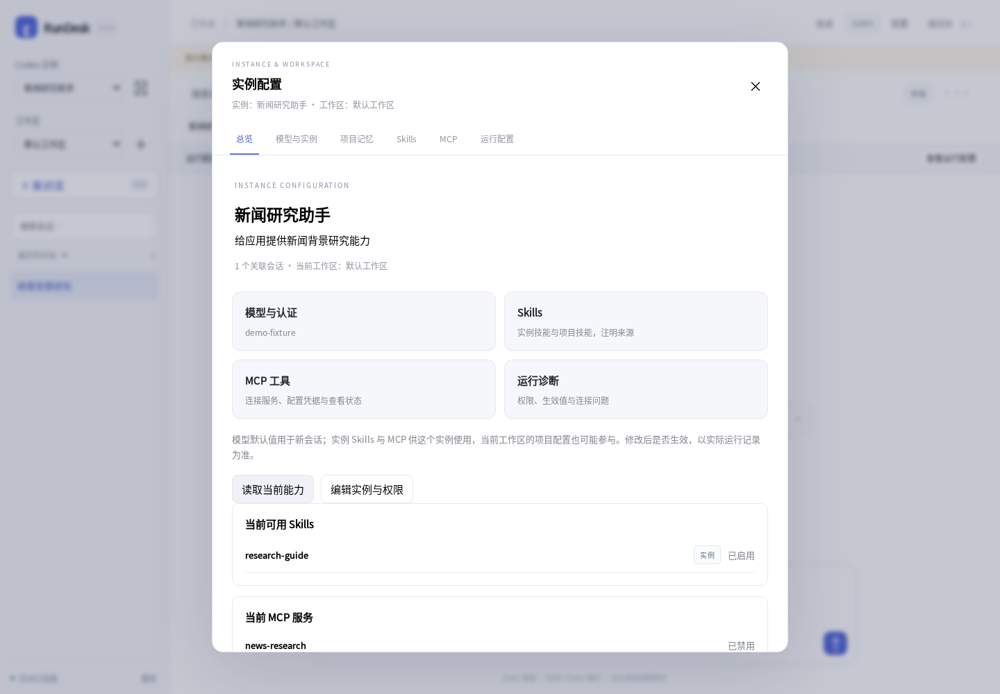
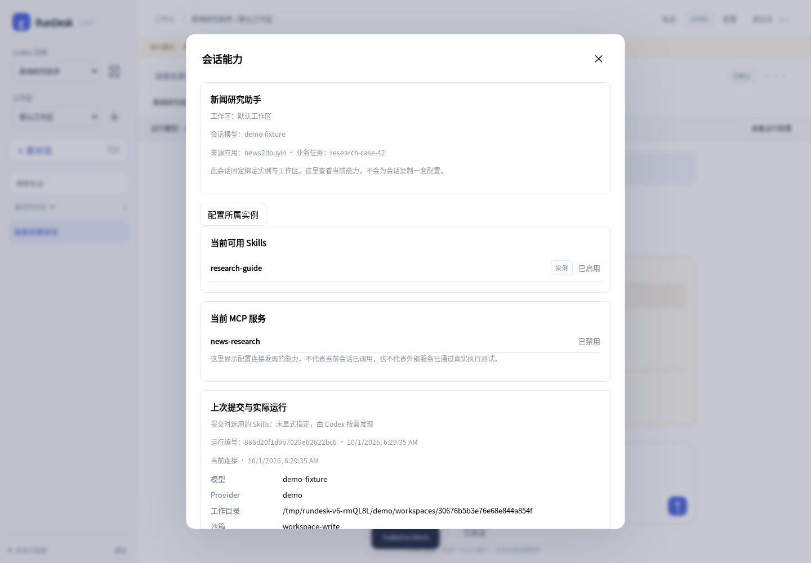

# RunDesk 0.6.0 验证记录

本版使用 Go 1.27.1、Chromium 154 与真实 HTTP 服务。Codex 侧为明确的协议模拟器，没有调用用户的真实模型或外部 MCP。

- `go test -race ./...`：40 项测试通过，0 失败、0 跳过；包含 8 项新增 v1 测试。
- `go vet ./...`：通过。
- OpenAPI 3.1：39 个路径、46 个操作，使用 openapi-spec-validator 0.9.0 校验通过。
- 新浏览器流程：13 项通过，包括丢失任务接收响应后重试、应用来源、实例总览、能力作用域、模型默认值与已有会话分离、停止、刷新和 390px 移动布局。
- 既有浏览器回归：会话管理、历史筛选、导出、文件预览、审批、Skills/MCP CRUD 与导入导出、诊断、实例切换和模型绑定通过，无页面 JS 异常。
- 0.5.4 → 0.6.0：用旧二进制建立数据，再用新二进制继续使用相同数据目录，8 项检查通过。核对原生线程、会话绑定、模型、笔记、实例 Skill、历史事件和增量游标；Python v1 客户端可继续旧线程并读取去重回执。
- 轨迹数据模型回归通过；本版没有改造轨迹界面。
- Linux amd64 静态可执行文件已运行；Windows amd64 交叉编译成功，未做 Windows 实机运行。

完整摘要见 `validation-0.6.0.json`。

## 复现

```bash
go test -race ./...
go vet ./...
python scripts/generate-openapi.py
node scripts/integration-smoke.cjs
node scripts/ui-smoke.cjs
node scripts/trace-model-test.cjs
python scripts/upgrade-smoke.py --old /path/to/rundesk-0.5.4 --new bin/rundesk
```

浏览器脚本需要开发用 Playwright、Chromium 和中文字体，可通过 PLAYWRIGHT_PATH、CHROME_PATH、FONTCONFIG_FILE 指定。本软件运行本身不需要 Node。

## 界面示例

均为模拟数据，不是真实模型研究结果。





## 验收边界

真实 Codex 版本与模型认证、外部 MCP 连通性和研究/视频应用业务结果仍需在部署环境验收。独立应用 Token 与访问范围暂未实现；来源标签仅供关联。图标、消息操作和轨迹设计不属于本版交付范围。
