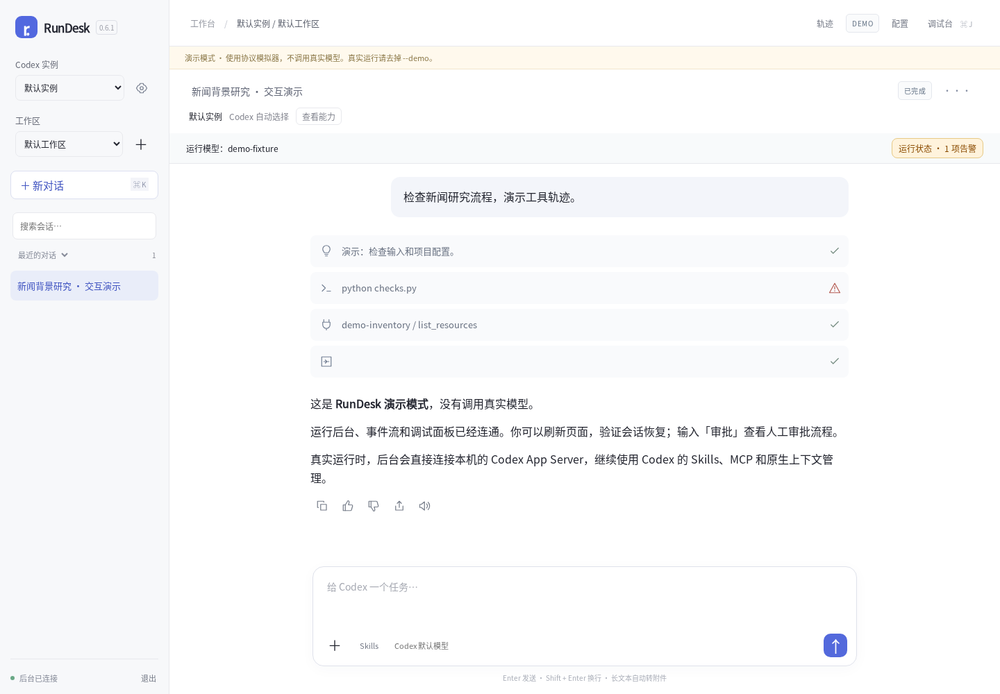
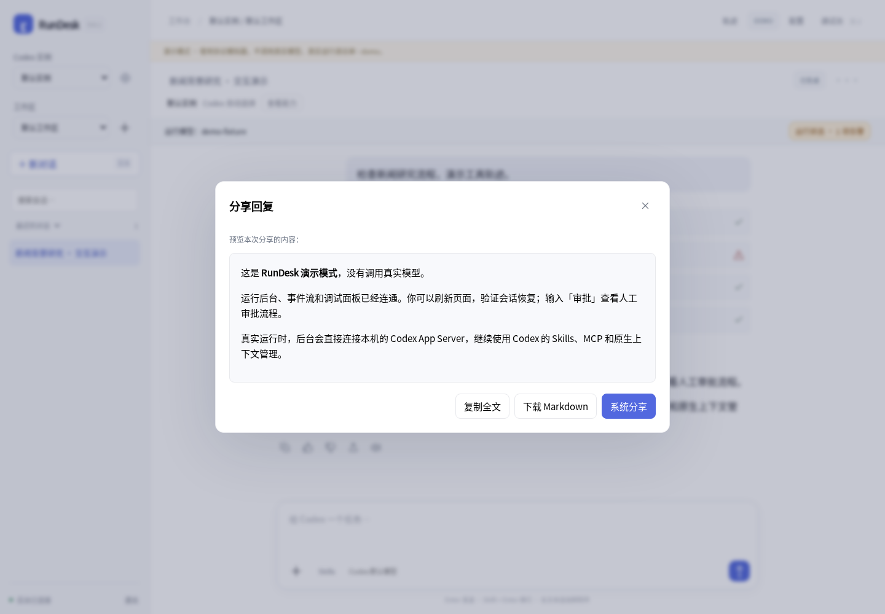
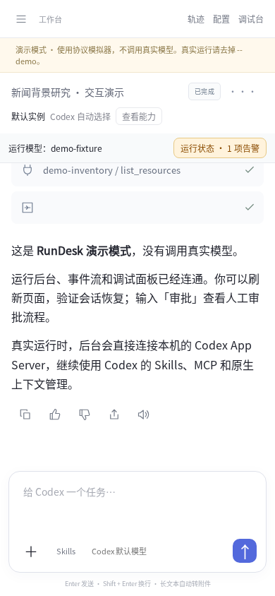
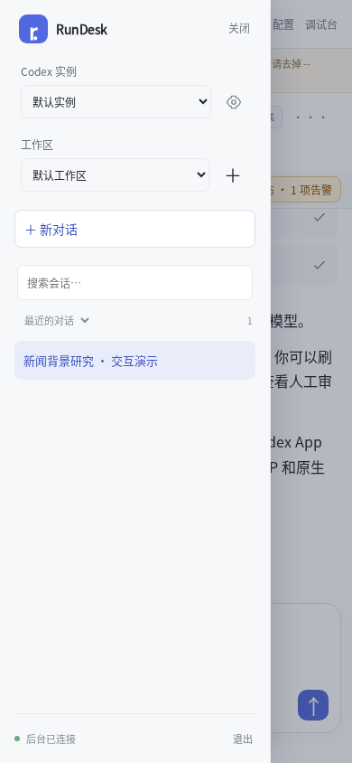

# RunDesk 0.6.1 验证记录

使用 Go 1.27.1、Chromium 154、实际 HTTP 服务和隔离的临时数据目录。模型侧为明确标识的 Codex 协议模拟器，没有调用真实模型或外部 MCP。

| 检查 | 结果 |
| --- | --- |
| Go 全量测试与 race detector | 42 项通过，0 失败、0 跳过。新增评价跨会话校验、输入校验、重复 PUT、删除清理及重启持久化。 |
| Go vet | 通过。 |
| 新回复操作浏览器检查 | 18 项通过，详见 screenshots/v0.6.1/reply-actions-report.json。 |
| 应用 API 与配置浏览器回归 | 13 项通过，含丢失提交回执后的恢复；旧 API 兼容。 |
| 既有 UI 回归 | 登录、会话管理、筛选、导出、实例、模型、Skills/MCP、审批、文件、配置与手机布局通过，无页面 JS 异常。 |
| 流式消息回归 | 卡片与日志节点不替换，展开状态、原始数据展开和输出滚动位置保留；跨轮次复用 itemId 与切换会话不串状态。 |
| OpenAPI 3.1 | 文档版本 1.1.0；42 个路径、49 个操作；openapi-spec-validator 0.9.0 验证通过。 |
| 0.6.0 → 0.6.1 实际二进制升级 | 8 项通过。会话、thread、实例、模型、工作区笔记、实例 Skill、原事件和游标保留；v1 客户端可以继续原 thread 和查询提交回执。 |
| 轨迹回归 | 数据模型测试通过；轨迹 JS、CSS 和后端投影代码与 0.6.0 相同。 |
| Linux / Windows | Linux amd64 静态构建和运行通过；Windows amd64 交叉编译成功，未在 Windows 实机运行。 |

新浏览器流程实际操作复制、代码复制、刷新恢复评价、查看原因、取消评价、保存失败状态、分享预览/下载、朗读控制与失败处理、手机会话抽屉。系统分享及 SpeechSynthesis 使用显式接口替身，验证传入内容、暂停/继续/停止、长文本分段结束、切换会话取消、失败与不支持状态，不能据此确认有声设备的声音和暂停行为。

完整结构化摘要见 [validation-0.6.1.json](validation-0.6.1.json)。

## 复现

```bash
go test -race ./...
go vet ./...
python scripts/generate-openapi.py
go build -buildvcs=false -o bin/rundesk ./cmd/rundesk
node scripts/reply-actions-smoke.cjs
node scripts/conversation-smoke.cjs
node scripts/integration-smoke.cjs
node scripts/ui-smoke.cjs
node scripts/trace-model-test.cjs
python scripts/upgrade-smoke.py --old /path/to/rundesk-0.6.0 --new bin/rundesk
```

浏览器测试需要开发用 Playwright、Chromium 和中文字体，可用 PLAYWRIGHT_PATH、CHROME_PATH、FONTCONFIG_FILE 指定。程序运行本身不需要 Node。重跑旧的 0.5.4 升级用例时，额外指定 `--old-version 0.5.4`；验证其他目标版本可用 `--new-version`。

## 界面检查

以下截图来自显式演示模式，桌面 1440 × 1000、手机 390 × 844；已人工检查图标、工具卡片、回复按钮、分享内容预览、抽屉和横向溢出。









## 验收边界

真实 Codex / 模型认证、外部 MCP、实际语音服务、系统分享目标和 Windows 桌面仍需在部署设备验收。本版未引入独立应用 Token 或访问范围；应用 source 标签继续仅用于业务关联。公开分享链接与轨迹重设计不在此次交付中。
